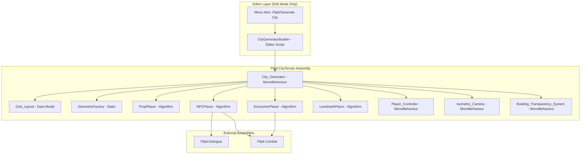
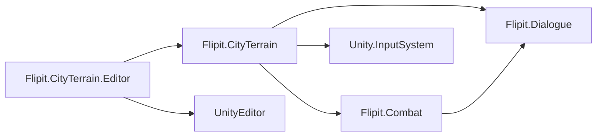
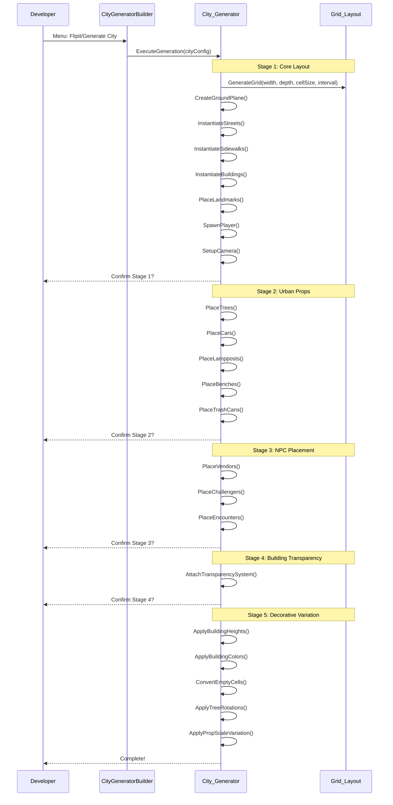

# Design Document: City Terrain Generation

## Overview

This design describes a modular, seed-based procedural city terrain generation system for Flipit. The system runs entirely in Edit Mode, triggered by a Unity Editor menu item, and produces a navigable city scene using placeholder geometry (cubes, cylinders, spheres). The city is structured as a 2D grid of typed cells (street, sidewalk, building, park) with five incremental generation stages, each separated by a developer confirmation dialog.

The architecture separates concerns into: grid data model (pure logic), geometry factory (GameObject creation), placement algorithms (prop/NPC distribution), and runtime components (player controller, camera, transparency). This separation enables property-based testing of the core algorithms independent of Unity's runtime.

**Key Design Decisions:**
- Grid-first approach: all placement decisions are made on the abstract grid before any GameObjects are instantiated
- Deterministic seeding: System.Random initialized from City_Config seed ensures reproducibility
- Edit Mode generation: no runtime generation overhead; the scene is pre-baked and saved
- Single-pass per stage: each stage reads the grid state left by previous stages

## Architecture

### System Architecture Diagram



### Assembly Dependencies



### Generation Pipeline (5 Stages)



## Components and Interfaces

### File Structure

```
Assets/
├── Scripts/
│   └── CityTerrain/
│       ├── Flipit.CityTerrain.asmdef
│       ├── City_Generator.cs
│       ├── City_Config.cs
│       ├── Data/
│       │   ├── Grid_Layout.cs
│       │   ├── CellType.cs
│       │   └── CellData.cs
│       ├── Generators/
│       │   ├── GeometryFactory.cs
│       │   ├── GridGenerator.cs
│       │   ├── LandmarkPlacer.cs
│       │   ├── PropPlacer.cs
│       │   ├── NPCPlacer.cs
│       │   └── EncounterPlacer.cs
│       ├── Runtime/
│       │   ├── Player_Controller.cs
│       │   ├── Isometric_Camera.cs
│       │   └── Building_Transparency_System.cs
│       └── Utilities/
│           └── PathFinder.cs
├── Editor/
│   ├── Flipit.CityTerrain.Editor.asmdef
│   └── CityGeneratorBuilder.cs
└── Scenes/
    └── CityExplorationScene.unity
```

### Core Interfaces and Class Signatures

#### CellType Enum

```csharp
namespace Flipit.CityTerrain
{
    public enum CellType
    {
        Street,
        Sidewalk,
        Building,
        Park,
        Empty
    }
}
```

#### CellData

```csharp
namespace Flipit.CityTerrain
{
    public struct CellData
    {
        public int Row { get; }
        public int Col { get; }
        public CellType Type { get; set; }
        public bool IsOccupied { get; set; }
        public bool IsIntersection { get; }
        public string OccupantTag { get; set; } // "tree", "car", "vendor", etc.

        public Vector3 WorldPosition(float cellSize);
        public int ManhattanDistance(CellData other);
    }
}
```

#### Grid_Layout

```csharp
namespace Flipit.CityTerrain
{
    /// <summary>
    /// Pure data model representing the city grid. No Unity dependencies except Vector2Int.
    /// All placement logic operates on this grid before any GameObjects are created.
    /// </summary>
    public class Grid_Layout
    {
        public int Width { get; }
        public int Depth { get; }
        public float CellSize { get; }
        public CellData[,] Cells { get; }

        public Grid_Layout(int width, int depth, float cellSize);

        public CellData GetCell(int row, int col);
        public void SetCellType(int row, int col, CellType type);
        public void MarkOccupied(int row, int col, string tag);
        public bool IsCellAvailable(int row, int col);
        public List<CellData> GetCellsOfType(CellType type);
        public List<CellData> GetUnoccupiedCellsOfType(CellType type);
        public List<CellData> GetAdjacentCells(int row, int col);
        public List<CellData> GetEdgeBuildingCells();
        public bool IsOnEdge(int row, int col);
    }
}
```

#### GridGenerator (Pure Algorithm)

```csharp
namespace Flipit.CityTerrain
{
    /// <summary>
    /// Generates the grid cell type assignments. Pure logic, no GameObjects.
    /// </summary>
    public static class GridGenerator
    {
        /// <summary>
        /// Assigns Street, Sidewalk, and Building types to all cells.
        /// Streets at every 'interval' row and column.
        /// Sidewalks on cells adjacent to streets (that aren't streets).
        /// Remaining cells become Building.
        /// </summary>
        public static void AssignCellTypes(Grid_Layout grid, int streetInterval);

        /// <summary>
        /// Returns true if the given cell is at a street intersection
        /// (row is a street row AND col is a street column).
        /// </summary>
        public static bool IsIntersection(int row, int col, int streetInterval);
    }
}
```

#### LandmarkPlacer

```csharp
namespace Flipit.CityTerrain
{
    /// <summary>
    /// Places School and House landmarks on opposite edges of the grid.
    /// Pure algorithm operating on Grid_Layout.
    /// </summary>
    public static class LandmarkPlacer
    {
        public struct LandmarkResult
        {
            public CellData SchoolCell;
            public CellData HouseCell;
            public CellData SchoolSpawnCell; // adjacent sidewalk
            public CellData HouseTriggerCell; // adjacent sidewalk
            public bool Success;
            public string ErrorMessage;
        }

        /// <summary>
        /// Finds valid positions for School and House landmarks.
        /// School on one edge, House on opposite edge.
        /// Minimum distance: 60% of grid diagonal.
        /// Both must be Building_Cells adjacent to a Sidewalk_Cell.
        /// </summary>
        public static LandmarkResult PlaceLandmarks(Grid_Layout grid);
    }
}
```

#### PropPlacer

```csharp
namespace Flipit.CityTerrain
{
    /// <summary>
    /// Places trees, cars, lampposts, benches, and trash cans on the grid.
    /// Uses seeded random for deterministic placement.
    /// </summary>
    public static class PropPlacer
    {
        public struct PlacementResult
        {
            public List<CellData> PlacedCells;
            public int RequestedCount;
            public int ActualCount;
            public string PropType;
        }

        public static PlacementResult PlaceTrees(
            Grid_Layout grid, System.Random rng,
            float sidewalkDensity, float parkDensity);

        public static PlacementResult PlaceCars(
            Grid_Layout grid, System.Random rng, float density);

        public static PlacementResult PlaceLampposts(
            Grid_Layout grid, int streetInterval);

        public static PlacementResult PlaceBenches(
            Grid_Layout grid, System.Random rng, float density);

        public static PlacementResult PlaceTrashCans(
            Grid_Layout grid, System.Random rng,
            float density, int minSpacing);
    }
}
```

#### NPCPlacer

```csharp
namespace Flipit.CityTerrain
{
    /// <summary>
    /// Places Vendor and Challenger NPCs on valid sidewalk cells with clearance rules.
    /// </summary>
    public static class NPCPlacer
    {
        public struct NPCPlacementResult
        {
            public List<CellData> PlacedCells;
            public int RequestedCount;
            public int ActualCount;
            public string NPCType;
        }

        /// <summary>
        /// Places vendors on sidewalk cells adjacent to buildings.
        /// Max 1 per city block. Minimum 2-cell clearance from other NPCs.
        /// </summary>
        public static NPCPlacementResult PlaceVendors(
            Grid_Layout grid, System.Random rng,
            int count, int streetInterval);

        /// <summary>
        /// Places challengers evenly along the path from school to house.
        /// Minimum 3-cell clearance from other NPCs.
        /// </summary>
        public static NPCPlacementResult PlaceChallengers(
            Grid_Layout grid, System.Random rng,
            int count, List<CellData> path);
    }
}
```

#### EncounterPlacer

```csharp
namespace Flipit.CityTerrain
{
    /// <summary>
    /// Places invisible trigger zones on navigable path cells.
    /// </summary>
    public static class EncounterPlacer
    {
        public struct EncounterPlacementResult
        {
            public List<CellData> PlacedCells;
            public int RequestedCount;
            public int ActualCount;
        }

        /// <summary>
        /// Places encounters on path cells with:
        /// - Minimum 3-cell spacing between encounters
        /// - Minimum 5-cell distance from landmarks
        /// - Not on occupied cells
        /// </summary>
        public static EncounterPlacementResult PlaceEncounters(
            Grid_Layout grid, System.Random rng,
            int count, List<CellData> path,
            CellData schoolCell, CellData houseCell);
    }
}
```

#### PathFinder

```csharp
namespace Flipit.CityTerrain
{
    /// <summary>
    /// BFS pathfinding on the grid. Finds navigable paths along
    /// street and sidewalk cells between two points.
    /// </summary>
    public static class PathFinder
    {
        /// <summary>
        /// Returns an ordered list of cells forming the shortest path
        /// from start to end, traversing only Street and Sidewalk cells.
        /// Returns empty list if no path exists.
        /// </summary>
        public static List<CellData> FindPath(
            Grid_Layout grid, CellData start, CellData end);
    }
}
```

#### GeometryFactory

```csharp
namespace Flipit.CityTerrain
{
    /// <summary>
    /// Creates Unity GameObjects for each cell/prop type.
    /// All created objects are assigned to the CityGeometry layer.
    /// </summary>
    public static class GeometryFactory
    {
        public static GameObject CreateGroundPlane(
            float width, float depth, Color color, Transform parent);

        public static GameObject CreateStreetCell(
            Vector3 position, float cellSize, Color color, Transform parent);

        public static GameObject CreateSidewalkCell(
            Vector3 position, float cellSize, Color color, Transform parent);

        public static GameObject CreateBuilding(
            Vector3 position, float cellSize, float height,
            Color color, Transform parent);

        public static GameObject CreateTree(
            Vector3 position, Color trunkColor,
            Color canopyColor, Transform parent);

        public static GameObject CreateCar(
            Vector3 position, float yRotation,
            Color color, Transform parent);

        public static GameObject CreateLamppost(
            Vector3 position, Color color, Transform parent);

        public static GameObject CreateBench(
            Vector3 position, float yRotation,
            Color color, Transform parent);

        public static GameObject CreateTrashCan(
            Vector3 position, Color color, Transform parent);

        public static GameObject CreateNPCCapsule(
            Vector3 position, Color color,
            string name, Transform parent);
    }
}
```

#### City_Generator (Orchestrator)

```csharp
namespace Flipit.CityTerrain
{
    /// <summary>
    /// Top-level MonoBehaviour that orchestrates all 5 generation stages.
    /// Attached to a root GameObject in the CityExplorationScene.
    /// </summary>
    public class City_Generator : MonoBehaviour
    {
        [SerializeField] private City_Config _config;

        // Hierarchy parents (auto-created)
        private Transform _groundParent;
        private Transform _streetsParent;
        private Transform _sidewalksParent;
        private Transform _buildingsParent;
        private Transform _propsParent;
        private Transform _npcsParent;
        private Transform _encountersParent;

        // Internal state
        private Grid_Layout _grid;
        private System.Random _rng;
        private LandmarkPlacer.LandmarkResult _landmarks;
        private List<CellData> _path;

        public void ExecuteGeneration();
        public void ClearGenerated();

        private bool ExecuteStage1_CoreLayout();
        private bool ExecuteStage2_UrbanProps();
        private bool ExecuteStage3_NPCPlacement();
        private bool ExecuteStage4_Transparency();
        private bool ExecuteStage5_Variation();

        private void LogStageCompletion(int stage, Dictionary<string, int> counts);
    }
}
```

#### Player_Controller

```csharp
namespace Flipit.CityTerrain
{
    /// <summary>
    /// CharacterController-based movement on XZ plane.
    /// Reads Move action from New Input System Player action map.
    /// </summary>
    [RequireComponent(typeof(CharacterController))]
    public class Player_Controller : MonoBehaviour
    {
        [SerializeField] private float _moveSpeed = 5f;

        private CharacterController _cc;
        private Vector2 _moveInput;
        private float _verticalVelocity;
        private const float Gravity = -9.81f;

        private void Awake();
        private void Update();
        public void OnMove(InputValue value); // Input System callback
    }
}
```

#### Isometric_Camera

```csharp
namespace Flipit.CityTerrain
{
    /// <summary>
    /// Orthographic camera at fixed isometric angle (30° X, 45° Y).
    /// Follows the player with configurable offset and smoothing.
    /// </summary>
    public class Isometric_Camera : MonoBehaviour
    {
        [SerializeField] private Transform _target;
        [SerializeField] private float _followOffset = 10f;
        [SerializeField] private float _smoothSpeed = 5f;
        [SerializeField] private float _orthoSize = 8f;

        private static readonly Quaternion IsometricRotation =
            Quaternion.Euler(30f, 45f, 0f);

        private void Start();
        private void LateUpdate();
    }
}
```

#### Building_Transparency_System

```csharp
namespace Flipit.CityTerrain
{
    /// <summary>
    /// Detects buildings between camera and player via raycast.
    /// Fades occluding buildings to configurable alpha over a duration.
    /// Restores alpha when no longer occluding.
    /// </summary>
    public class Building_Transparency_System : MonoBehaviour
    {
        [SerializeField] private Transform _player;
        [SerializeField] private float _targetAlpha = 0.3f;
        [SerializeField] private float _fadeDuration = 0.2f;
        [SerializeField] private LayerMask _cityGeometryLayer;

        private Dictionary<Renderer, FadeState> _trackedBuildings;

        private struct FadeState
        {
            public float CurrentAlpha;
            public float TargetAlpha;
            public Material Material;
        }

        private void Update();
        private HashSet<Renderer> DetectOccludingBuildings();
        private void SetMaterialTransparent(Material mat);
        private void SetMaterialOpaque(Material mat);
    }
}
```

#### CityGeneratorBuilder (Editor Script)

```csharp
// Located in Assets/Editor/CityGeneratorBuilder.cs
using UnityEditor;
using UnityEditor.SceneManagement;
using Flipit.CityTerrain;

/// <summary>
/// Editor script exposing "Flipit/Generate City" menu item.
/// Creates/opens CityExplorationScene, finds or creates City_Generator,
/// executes generation with confirmation dialogs between stages.
/// </summary>
public static class CityGeneratorBuilder
{
    private const string ScenePath = "Assets/Scenes/CityExplorationScene.unity";
    private const string MenuPath = "Flipit/Generate City";

    [MenuItem(MenuPath)]
    public static void GenerateCity();

    private static bool ShowStageConfirmation(int stage, string summary);
}
```

### Key Algorithms

#### Grid Cell Assignment Algorithm

```
Input: width, depth, streetInterval (clamped to min 3)
Output: Grid_Layout with all cells typed

1. For each row r in [0, depth):
     For each col c in [0, width):
       if (r % streetInterval == 0) OR (c % streetInterval == 0):
         cells[r,c].Type = Street
       else:
         cells[r,c].Type = Building  // provisional

2. For each cell where Type == Building:
     if any orthogonal neighbor is Street:
       cells[r,c].Type = Sidewalk

3. Remaining Building cells stay as Building
```

This guarantees:
- Streets form complete rows/columns (every streetInterval)
- All streets are connected (they span the full grid)
- Sidewalks buffer all streets from buildings
- Every non-street, non-sidewalk cell is a building

#### Landmark Placement Algorithm

```
Input: Grid_Layout (typed), cellSize
Output: LandmarkResult (school cell, house cell, spawn cell, trigger cell)

1. Collect all Building_Cells on grid edges (row==0, row==last, col==0, col==last)
   that are adjacent to at least one Sidewalk_Cell
2. Group edge cells by edge (top, bottom, left, right)
3. Define opposite edge pairs: (top, bottom), (left, right)
4. For each pair (edgeA, edgeB):
     For each candidate school in edgeA:
       For each candidate house in edgeB:
         distance = Euclidean(school.WorldPos, house.WorldPos)
         diagonal = sqrt((width*cellSize)² + (depth*cellSize)²)
         if distance >= 0.6 * diagonal:
           return (school, house, adjacentSidewalk(school), adjacentSidewalk(house))
5. If no valid pair found: return failure
```

#### Pathfinding (BFS)

```
Input: Grid_Layout, startCell, endCell
Output: List<CellData> path (ordered start→end)

1. Queue = [startCell], Visited = {startCell}, Parent = {}
2. While Queue not empty:
     current = Queue.Dequeue()
     if current == endCell: reconstruct path from Parent map
     for each neighbor in orthogonal neighbors of current:
       if neighbor.Type in {Street, Sidewalk} AND not Visited:
         Visited.Add(neighbor)
         Parent[neighbor] = current
         Queue.Enqueue(neighbor)
3. Return empty list if endCell unreachable
```

#### Prop Density Placement Algorithm

```
Input: Grid_Layout, eligibleCells, density, rng, minSpacing (optional)
Output: List<CellData> placed cells

1. Shuffle eligibleCells using rng
2. targetCount = floor(eligibleCells.Count * density)
3. placed = []
4. For each cell in shuffled eligibleCells:
     if placed.Count >= targetCount: break
     if cell.IsOccupied: continue
     if minSpacing > 0:
       if any in placed has ManhattanDistance(cell) < minSpacing: continue
     placed.Add(cell)
     cell.MarkOccupied(propType)
5. Return placed
```

#### NPC Placement Along Path Algorithm

```
Input: Grid_Layout, path, count, minClearance, existingNPCs, rng
Output: List<CellData> NPC positions

1. segmentLength = path.Count / (count + 1)
2. targetIndices = [segmentLength, 2*segmentLength, ..., count*segmentLength]
3. placed = []
4. For each targetIdx in targetIndices:
     Find nearest unoccupied Sidewalk_Cell to path[targetIdx]
       that has ManhattanDistance >= minClearance from all existingNPCs and placed
     if found: placed.Add(cell), mark occupied
     else: log warning, continue
5. Return placed
```

#### Building Transparency Detection Algorithm

```
Input: cameraPosition, playerPosition, cityGeometryLayer
Output: Set<Renderer> occluding buildings

1. direction = playerPosition - cameraPosition
2. distance = direction.magnitude
3. hits = Physics.RaycastAll(cameraPosition, direction.normalized, distance, cityGeometryLayer)
4. occluding = new HashSet<Renderer>()
5. For each hit in hits:
     renderer = hit.collider.GetComponent<Renderer>()
     if renderer != null AND hit.collider.gameObject != player:
       occluding.Add(renderer)
6. Return occluding
```

#### Alpha Fade Algorithm (per frame)

```
For each tracked building renderer:
  if renderer in currentlyOccluding:
    fadeState.TargetAlpha = configAlpha (e.g., 0.3)
  else:
    fadeState.TargetAlpha = 1.0

  fadeState.CurrentAlpha = Mathf.MoveTowards(
    fadeState.CurrentAlpha, fadeState.TargetAlpha,
    (1.0 / fadeDuration) * Time.deltaTime)

  Apply fadeState.CurrentAlpha to material
  if fadeState.CurrentAlpha < 1.0: SetMaterialTransparent()
  else: SetMaterialOpaque(), remove from tracked
```

## Data Models

### City_Config ScriptableObject

```csharp
namespace Flipit.CityTerrain
{
    [CreateAssetMenu(fileName = "NewCityConfig", menuName = "Flipit/City Config")]
    public class City_Config : ScriptableObject
    {
        [Header("Grid Settings")]
        [SerializeField, Min(5)] private int _gridWidth = 10;
        [SerializeField, Min(5)] private int _gridDepth = 10;
        [SerializeField, Min(1f)] private float _cellSize = 4f;
        [SerializeField, Range(3, 10)] private int _streetInterval = 4;

        [Header("Seed")]
        [SerializeField] private int _randomSeed = 0; // 0 = random

        [Header("Player & Camera")]
        [SerializeField, Min(0.1f)] private float _playerMoveSpeed = 5f;
        [SerializeField, Min(1f)] private float _cameraOrthoSize = 8f;
        [SerializeField, Min(1f)] private float _cameraFollowOffset = 10f;
        [SerializeField, Min(0.1f)] private float _cameraSmoothSpeed = 5f;

        [Header("Building Variation")]
        [SerializeField, Min(0.5f)] private float _buildingHeightMin = 2f;
        [SerializeField, Min(0.5f)] private float _buildingHeightMax = 5f;
        [SerializeField] private List<Color> _buildingColorPalette; // min 5
        [SerializeField, Range(0f, 0.5f)] private float _cellConversionPercent = 0.2f;

        [Header("Prop Density")]
        [SerializeField, Range(0f, 1f)] private float _treeDensitySidewalk = 0.33f;
        [SerializeField, Range(0f, 1f)] private float _treeDensityPark = 0.5f;
        [SerializeField, Range(0f, 1f)] private float _carDensity = 0.2f;
        [SerializeField, Range(0f, 1f)] private float _benchDensity = 1f;
        [SerializeField, Range(0f, 1f)] private float _trashCanDensity = 0.125f;

        [Header("NPC Counts")]
        [SerializeField, Min(0)] private int _vendorCount = 3;
        [SerializeField, Range(1, 10)] private int _challengerCount = 4;
        [SerializeField, Range(1, 10)] private int _surpriseEncounterCount = 3;

        [Header("NPC References")]
        [SerializeField] private DialogueData[] _vendorDialogues;
        [SerializeField] private DialogueData[] _challengerDialogues;
        [SerializeField] private EncounterConfig[] _challengerEncounterConfigs;
        [SerializeField] private DialogueData _forcedEncounterDialogue;
        [SerializeField] private string _combatSceneName = "CombatScene";

        [Header("Transparency")]
        [SerializeField, Range(0f, 1f)] private float _transparencyAlpha = 0.3f;
        [SerializeField, Min(0.01f)] private float _fadeDuration = 0.2f;

        [Header("Colors")]
        [SerializeField] private Color _groundPlaneColor = new(0.5f, 0.5f, 0.5f, 1f);
        [SerializeField] private Color _streetColor = new(0.3f, 0.3f, 0.3f, 1f);
        [SerializeField] private Color _sidewalkColor = new(0.7f, 0.7f, 0.7f, 1f);
        [SerializeField] private Color _schoolColor = Color.blue;
        [SerializeField] private Color _houseColor = Color.green;
        [SerializeField] private Color _vendorColor = Color.yellow;
        [SerializeField] private Color _challengerColor = Color.red;
        [SerializeField] private Color _treeTrunkColor = new(0.4f, 0.25f, 0.1f, 1f);
        [SerializeField] private Color _treeCanopyColor = new(0.2f, 0.7f, 0.2f, 1f);

        // Public properties with clamping (same pattern as EncounterConfig)
        public int GridWidth => Mathf.Max(_gridWidth, 5);
        public int GridDepth => Mathf.Max(_gridDepth, 5);
        public float CellSize => Mathf.Max(_cellSize, 1f);
        public int StreetInterval => Mathf.Clamp(_streetInterval, 3, 10);
        public int RandomSeed => _randomSeed;
        // ... (all other properties follow same clamping pattern)
    }
}
```

### Grid_Layout Data Structure

The grid is a 2D array of `CellData` structs indexed by `[row, col]`:

```
Grid_Layout (10x10 example, streetInterval=4):

     Col: 0   1   2   3   4   5   6   7   8   9
Row 0:   [St] [St] [St] [St] [St] [St] [St] [St] [St] [St]   ← street row
Row 1:   [St] [Sw] [Bl] [Sw] [St] [Sw] [Bl] [Sw] [St] [Sw]
Row 2:   [St] [Bl] [Bl] [Bl] [St] [Bl] [Bl] [Bl] [St] [Bl]  (not possible,
Row 3:   [St] [Sw] [Bl] [Sw] [St] [Sw] [Bl] [Sw] [St] [Sw]   col 0,4,8 are streets)
Row 4:   [St] [St] [St] [St] [St] [St] [St] [St] [St] [St]   ← street row
...

Legend: St=Street, Sw=Sidewalk, Bl=Building
```

The grid world origin is (0, 0, 0). Cell world position:
- `x = col * cellSize`
- `z = row * cellSize`
- `y` depends on cell type (0 for street, 0.05 for sidewalk)

### Scene Hierarchy Structure

```
CityExplorationScene
├── City_Generator (City_Generator component, City_Config reference)
├── Ground/
│   └── GroundPlane (Quad mesh, MeshCollider)
├── Streets/
│   └── Street_R0_C0, Street_R0_C1, ... (flat quads at Y=0)
├── Sidewalks/
│   └── Sidewalk_R1_C1, ... (flat quads at Y=0.05)
├── Buildings/
│   ├── School_Landmark (scaled cube, BoxCollider)
│   │   └── SpawnPoint (empty GameObject)
│   ├── House_Landmark (cube, BoxCollider, trigger collider)
│   └── Building_R2_C2, ... (cubes with BoxColliders)
├── Props/
│   ├── Tree_R1_C3/ (Trunk cylinder + Canopy sphere)
│   ├── Car_R0_C5/ (Body cube + Cabin cube)
│   ├── Lamppost_R0_C1/ (cylinder + sphere)
│   ├── Bench_R3_C1 (flattened cube)
│   └── TrashCan_R5_C3 (cylinder)
├── NPCs/
│   ├── Vendor_0 (capsule, NPC_Interactable, CapsuleCollider)
│   ├── Challenger_0 (capsule, FlipCombat_NPC, CapsuleCollider)
│   └── ...
├── Encounters/
│   └── Encounter_0 (BoxCollider trigger, TriggerZone_Encounter)
├── Player (CharacterController, Player_Controller, PlayerInput)
└── Isometric_Camera (Camera, Isometric_Camera, Building_Transparency_System)
```

## Correctness Properties

*A property is a characteristic or behavior that should hold true across all valid executions of a system—essentially, a formal statement about what the system should do. Properties serve as the bridge between human-readable specifications and machine-verifiable correctness guarantees.*

### Property 1: Grid Cell Partition

*For any* valid grid configuration (width ≥ 5, depth ≥ 5, streetInterval ≥ 3), after grid generation every cell is assigned exactly one type from {Street, Sidewalk, Building}, and the union of all typed cells equals the total grid area (width × depth).

**Validates: Requirements 2.1, 2.3, 2.4**

### Property 2: Street Connectivity

*For any* valid grid configuration, all Street_Cells form a connected graph (any street cell is reachable from any other street cell via orthogonal adjacency through other street cells).

**Validates: Requirements 2.1**

### Property 3: Sidewalk Adjacency Invariant

*For any* valid grid configuration, every cell that is orthogonally adjacent to a Street_Cell and is not itself a Street_Cell is assigned the Sidewalk type.

**Validates: Requirements 2.3**

### Property 4: Street Placement at Intervals

*For any* valid grid configuration with streetInterval I, a cell at (row, col) is a Street_Cell if and only if (row % I == 0) or (col % I == 0).

**Validates: Requirements 2.2**

### Property 5: Cell Height Correctness

*For any* generated city, all Street_Cells are instantiated at Y=0 and all Sidewalk_Cells are instantiated at Y=0.05.

**Validates: Requirements 2.5, 2.6**

### Property 6: Ground Plane Dimensions

*For any* valid grid configuration, the generated Ground_Plane has width equal to (gridWidth × cellSize) and depth equal to (gridDepth × cellSize).

**Validates: Requirements 1.1**

### Property 7: Landmark Placement Constraints

*For any* valid grid configuration where landmark placement succeeds, the School_Landmark is on a grid-edge Building_Cell adjacent to a Sidewalk_Cell, the House_Landmark is on the opposite edge adjacent to a Sidewalk_Cell, and the Euclidean distance between them is ≥ 60% of the grid diagonal.

**Validates: Requirements 3.1, 3.2**

### Property 8: School Spawn Point Position

*For any* generated city with successful landmark placement, the School spawn point is located at the center of the Sidewalk_Cell adjacent to the School_Landmark at sidewalk surface height (Y=0.05).

**Validates: Requirements 3.5**

### Property 9: Player Movement Vector Transformation

*For any* Move input Vector2 (x, y) and configured moveSpeed, the Player_Controller applies movement as (x, 0, y) × moveSpeed × deltaTime on the XZ plane, with zero XZ translation when input is zero.

**Validates: Requirements 4.3, 4.5**

### Property 10: Camera Rotation Invariant

*For any* sequence of player movements and positions, the Isometric_Camera maintains rotation (30, 45, 0) and never changes orientation.

**Validates: Requirements 5.2, 5.5**

### Property 11: Camera Follow Target Position

*For any* player world position P, the Isometric_Camera target position is P + (followOffset units along the camera's back-vector from the isometric rotation).

**Validates: Requirements 5.3**

### Property 12: Collider Type Correctness

*For any* generated geometry, the collider type matches the shape: BoxCollider for buildings, cars, and benches; CapsuleCollider for trees, lampposts, and trash cans. All generated buildings and props are assigned to the "CityGeometry" physics layer.

**Validates: Requirements 6.1, 6.2, 6.3, 6.4**

### Property 13: Cell Occupancy Invariant

*For any* generated city after all stages complete, no cell has more than one occupant (prop, NPC, or encounter trigger).

**Validates: Requirements 7.4, 8.5, 9.7, 12.7**

### Property 14: Prop Placement on Valid Cell Types

*For any* generated city: trees are only on Sidewalk or Park cells; cars are only on non-intersection Street_Cells adjacent to Sidewalk; lampposts are on intersection-corner Sidewalk_Cells; benches are on Sidewalk_Cells adjacent to Park_Cells; trash cans are on Sidewalk_Cells.

**Validates: Requirements 7.1, 8.1, 9.1, 9.2, 9.3**

### Property 15: Prop Density Count

*For any* valid density configuration and set of eligible cells, the number of placed props equals floor(eligibleCells × density) or the maximum available unoccupied cells, whichever is smaller.

**Validates: Requirements 7.2, 8.2**

### Property 16: Car Orientation Matches Street Direction

*For any* placed car, its Y-rotation is 0° or 180° if on a horizontal street (street-row cell), and 90° or 270° if on a vertical street (street-column cell).

**Validates: Requirements 8.4**

### Property 17: Trash Can Minimum Spacing

*For any* two placed trash cans in the city, their Manhattan distance is ≥ 3 cells.

**Validates: Requirements 9.3**

### Property 18: NPC Placement Validity and Clearance

*For any* generated city: all Vendor_NPCs are on Sidewalk_Cells adjacent to Building_Cells with ≥ 2-cell Manhattan distance from other NPCs; all Challenger_NPCs are on Sidewalk_Cells with ≥ 3-cell Manhattan distance from other NPCs; no city block contains more than 1 Vendor_NPC.

**Validates: Requirements 10.1, 10.2, 10.4, 11.1, 11.4**

### Property 19: NPC Component Setup

*For any* generated Vendor_NPC, it has a CapsuleCollider and NPC_Interactable component. *For any* generated Challenger_NPC, it has a CapsuleCollider and FlipCombat_NPC component with valid DialogueData and EncounterConfig references.

**Validates: Requirements 10.3, 11.3**

### Property 20: Challenger Even Distribution Along Path

*For any* set of placed challengers and the navigable path from school to house, challengers are approximately evenly spaced along the path (each gap between consecutive challengers is within ±30% of the average gap).

**Validates: Requirements 11.2**

### Property 21: Encounter Placement Constraints

*For any* placed Surprise_Encounter: it is on a Street or Sidewalk cell that is part of the navigable path; its Manhattan distance from any other encounter is ≥ 3 cells; its Manhattan distance from both School_Landmark and House_Landmark is ≥ 5 cells.

**Validates: Requirements 12.1, 12.2, 12.5**

### Property 22: Encounter Invisibility

*For any* generated Surprise_Encounter, it has no enabled MeshRenderer or SpriteRenderer, and has a BoxCollider marked as trigger with size covering the full cell area.

**Validates: Requirements 12.3, 12.6**

### Property 23: Building Transparency Round-Trip

*For any* building that transitions to transparent (due to occluding the player), when the player moves such that the building no longer occludes, the building's material alpha returns to 1.0 and its rendering mode reverts to opaque.

**Validates: Requirements 13.2, 13.3**

### Property 24: Transparency Applies to All Occluding Buildings

*For any* set of buildings simultaneously between the camera and player, all of them have their material alpha reduced to the configured transparency value (independently tracked).

**Validates: Requirements 13.6**

### Property 25: No Transparency Modification Without Occlusion

*For any* frame where no building collider intersects the camera-to-player ray, no building material is modified from its current state.

**Validates: Requirements 13.7**

### Property 26: Alpha Transition Continuity

*For any* building undergoing transparency transition, the alpha value changes continuously via linear interpolation over the configured fade duration — there are no instantaneous jumps between alpha values.

**Validates: Requirements 13.5**

### Property 27: Building Variation Within Config Bounds

*For any* non-landmark building after Stage 5, its Y-scale is within [buildingHeightMin, buildingHeightMax] and its material color is one of the colors in the config palette.

**Validates: Requirements 14.1, 14.2**

### Property 28: Cell Conversion Adjacency Rule

*For any* cell converted to Building in Stage 5, it was previously unoccupied and is adjacent to at least one existing Building_Cell. The total converted count equals floor(eligibleEmptyCells × conversionPercentage).

**Validates: Requirements 14.3**

### Property 29: Prop Scale Variation Bounds

*For any* prop placed in Stage 2, after Stage 5 its uniform scale is within [0.8, 1.2].

**Validates: Requirements 14.5**

### Property 30: Tree Canopy Rotation Values

*For any* tree after Stage 5, its canopy Y-rotation is one of {0, 90, 180, 270} degrees.

**Validates: Requirements 14.4**

### Property 31: Seed Determinism

*For any* City_Config with a non-zero seed, running the complete generation pipeline twice produces identical results (same cell types, same placements, same heights, same colors, same rotations, same scales).

**Validates: Requirements 14.6**

### Property 32: Config Value Clamping

*For any* City_Config numeric field set outside its defined [min, max] range, the generation system clamps it to the nearest valid bound and logs a warning identifying the field, invalid value, and clamped value.

**Validates: Requirements 15.11, 15.12**

### Property 33: Hierarchy Organization

*For any* generated city, all GameObjects are children of the correct root-level parent: ground mesh under "Ground", street quads under "Streets", sidewalk quads under "Sidewalks", building cubes under "Buildings", props under "Props", NPCs under "NPCs", encounters under "Encounters".

**Validates: Requirements 17.4**

### Property 34: Clean Regeneration

*For any* regeneration operation, after clearing and re-generating with the same config and seed, the resulting hierarchy is identical to a fresh generation (no leftover objects from previous runs).

**Validates: Requirements 17.6**

## Error Handling

### Validation Errors (Abort Generation)

| Condition | Behavior | Requirement |
|-----------|----------|-------------|
| Color palette < 5 entries | Log error, abort entire generation | 15.13 |
| Landmark placement impossible | Log error, abort Stage 1 | 3.7 |
| Stage execution error | Log error, preserve previous stages, show error dialog | 16.9 |

### Validation Warnings (Clamp and Continue)

| Condition | Behavior | Requirement |
|-----------|----------|-------------|
| Street interval < 3 | Clamp to 3, log warning | 2.7 |
| Any numeric field out of range | Clamp to nearest bound, log warning with field name | 15.11 |
| Building height max < min | Set max = min, log warning | 15.12 |
| Ground plane color is black/zero-alpha | Apply fallback gray (0.5, 0.5, 0.5, 1.0), log warning | 1.4 |
| Insufficient cells for prop density | Place maximum possible, log warning with deficit | 9.8 |
| Insufficient cells/blocks for NPCs | Place maximum possible, log warning with deficit | 10.6, 11.6 |

### Runtime Error Handling

| Component | Condition | Behavior |
|-----------|-----------|----------|
| Player_Controller | No CharacterController | Log error in Awake, disable component |
| Isometric_Camera | Target is null | Skip follow logic, maintain last position |
| Building_Transparency_System | Player reference null | Disable system, log warning |
| Building_Transparency_System | Material has no _Color property | Skip that renderer |

## Testing Strategy

### Approach

The system separates pure algorithmic logic (grid generation, placement algorithms, pathfinding) from Unity-dependent code (GameObject creation, MonoBehaviour runtime). This separation enables thorough automated testing:

- **Property-based tests** (via [FsCheck](https://fscheck.github.io/FsCheck/) for C#/.NET): validate universal invariants of the grid algorithms across thousands of random configurations
- **Unit tests** (via Unity Test Framework / NUnit): validate specific examples, component setup, edge cases
- **Integration tests**: validate full pipeline execution in Edit Mode tests

### Property-Based Testing Configuration

- **Library**: FsCheck (NuGet package `FsCheck` + `FsCheck.NUnit` for integration with Unity Test Framework)
- **Minimum iterations**: 100 per property
- **Tag format**: `// Feature: city-terrain-generation, Property {N}: {title}`
- Each correctness property maps to exactly one property-based test

### Test Categories

#### Pure Algorithm Tests (Property-Based)

These test the grid/placement logic independent of Unity GameObjects:

| Property | Test Target | Generator Strategy |
|----------|-------------|-------------------|
| 1–5 | GridGenerator.AssignCellTypes | Random (width 5–30, depth 5–30, interval 3–8) |
| 6 | Ground plane calculation | Random (width, depth, cellSize) |
| 7–8 | LandmarkPlacer.PlaceLandmarks | Random valid grids |
| 9 | Player movement math | Random Vector2 inputs, speeds, deltaTimes |
| 10–11 | Camera position calculation | Random player positions |
| 12 | GeometryFactory collider assignment | Random prop types |
| 13–17 | PropPlacer algorithms | Random grids with random densities and seeds |
| 18–20 | NPCPlacer algorithms | Random grids with random NPC counts |
| 21–22 | EncounterPlacer algorithm | Random grids with random encounter counts |
| 27–31 | Stage 5 variation algorithms | Random grids with random config values |
| 32 | Config clamping logic | Random out-of-bound values |
| 33–34 | Hierarchy organization | Random configurations |

#### Unit Tests (Example-Based)

| Test | What it validates |
|------|-------------------|
| Ground plane material is unlit | Req 1.2 |
| Ground plane has MeshCollider | Req 1.3 |
| Fallback color applied on missing config | Req 1.4 |
| School building scale is 1.5×cellSize | Req 3.3 |
| House building scale is 1×cellSize | Req 3.4 |
| CharacterController params (radius, height, center) | Req 4.2 |
| Camera is orthographic with configured size | Req 5.1, 5.4 |
| Tree geometry dimensions | Req 7.3 |
| Car geometry dimensions | Req 8.3 |
| Lamppost/Bench/TrashCan geometry | Req 9.4, 9.5, 9.6 |
| Vendor/Challenger capsule with color | Req 10.5, 11.5 |
| Encounter TriggerZone_Encounter component wired | Req 12.4 |
| Transparency system added to camera | Req 13.1 |

#### Edge Case Tests

| Test | What it validates |
|------|-------------------|
| Minimum grid (5×5) with interval 3 | All invariants hold at boundary |
| All cells occupied before NPC placement | Warning logged, no crash |
| Seed 0 produces non-deterministic results | Different runs differ |
| Building height max < min in config | Corrected to max=min |
| Color palette with exactly 5 entries | Works without error |
| Street interval set to 2 | Clamped to 3 with warning |

#### Integration Tests (Edit Mode)

| Test | What it validates |
|------|-------------------|
| Full 5-stage generation completes | No exceptions, scene saved |
| Regeneration destroys old content | No duplicates |
| Menu item accessible | Editor menu works |
| Assembly references compile | Flipit.CityTerrain → Flipit.Dialogue + Flipit.Combat |

### Assembly Definitions for Tests

```json
// Assets/Tests/Editor/Flipit.CityTerrain.Tests.Editor.asmdef
{
    "name": "Flipit.CityTerrain.Tests.Editor",
    "rootNamespace": "Flipit.CityTerrain.Tests",
    "references": ["Flipit.CityTerrain", "Flipit.Dialogue", "Flipit.Combat"],
    "includePlatforms": ["Editor"],
    "overrideReferences": true,
    "precompiledReferences": ["nunit.framework.dll", "FsCheck.dll"],
    "defineConstraints": ["UNITY_INCLUDE_TESTS"]
}
```
