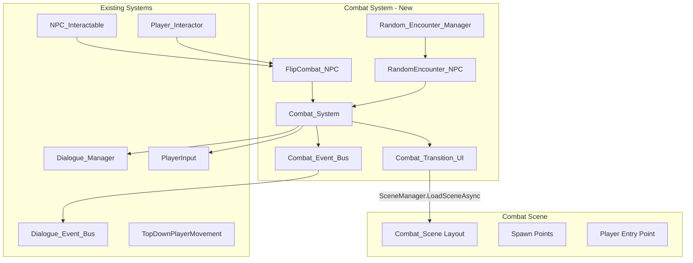
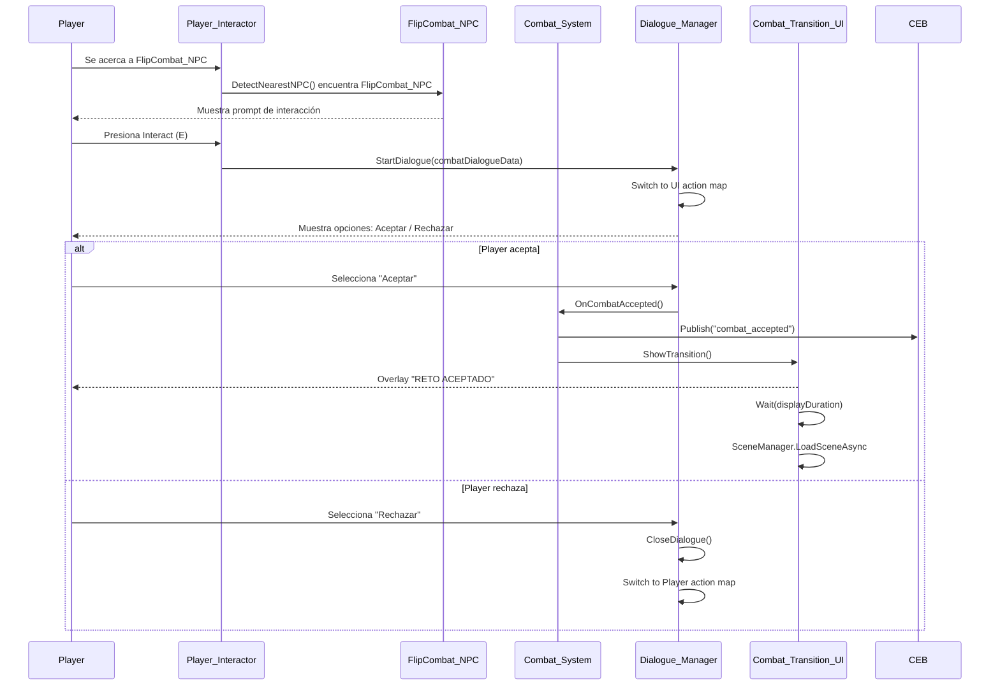
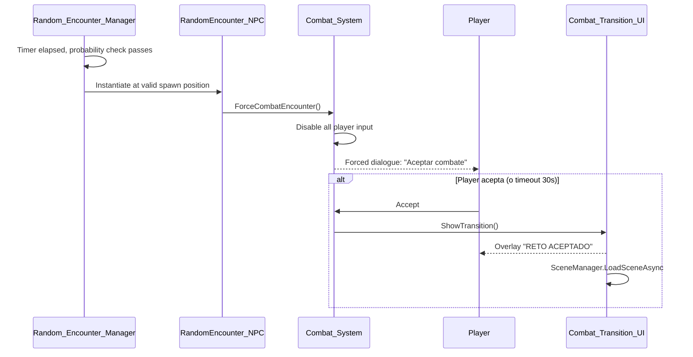

# Design Document: Combat System

## Overview

El sistema de combate para Flipit gestiona dos formas de iniciar partidas: interacción voluntaria con NPCs estáticos (FlipCombat_NPC) y encuentros aleatorios forzados (RandomEncounter_NPC). Ambos flujos convergen en una transición con viñeta "RETO ACEPTADO" que carga una escena de combate dedicada — una ciudad top-down con múltiples NPCs de combate.

El diseño reutiliza la infraestructura existente del sistema de diálogo (Dialogue_Manager, Dialogue_Event_Bus, Player_Interactor, NPC_Interactable) y extiende los patrones establecidos (herencia de NPC_Interactable, action map switching, estado singleton) para minimizar complejidad y tiempo de implementación.

### Decisiones clave de diseño

1. **FlipCombat_NPC hereda de NPC_Interactable**: Reutiliza la detección por proximidad del Player_Interactor sin modificar código existente.
2. **Combat_Event_Bus separado del Dialogue_Event_Bus**: El Dialogue_Event_Bus gestiona estado de eventos narrativos; el combate necesita su propio canal de eventos para no contaminar el flujo de diálogos.
3. **ScriptableObject para configuración de encuentros**: Permite ajustar balanceo sin recompilar.
4. **Coroutine-based transitions**: Patrón consistente con el Typewriter_Effect existente; adecuado para la simplicidad del hackathon.

## Architecture



### Flujo de interacción voluntaria (FlipCombat_NPC)



### Flujo de encuentro aleatorio (RandomEncounter_NPC)



## Components and Interfaces

### FlipCombat_NPC : NPC_Interactable

```csharp
namespace Flipit.Combat
{
    /// <summary>
    /// NPC de combate estático. Hereda de NPC_Interactable para reutilizar
    /// la detección por proximidad del Player_Interactor.
    /// Contiene DialogueData con opciones de aceptar/rechazar combate.
    /// </summary>
    public class FlipCombat_NPC : NPC_Interactable
    {
        [SerializeField] private string _combatSceneName;
        [SerializeField] private string _npcDisplayName;
        
        public string CombatSceneName => _combatSceneName;
        public string NpcDisplayName => _npcDisplayName;
    }
}
```

**Rationale**: Al heredar de NPC_Interactable, el Player_Interactor existente detecta estos NPCs sin modificaciones. El DialogueData del NPC contendrá las opciones "Aceptar"/"Rechazar".

### RandomEncounter_NPC

```csharp
namespace Flipit.Combat
{
    /// <summary>
    /// NPC de encuentro aleatorio. Se instancia dinámicamente cerca del jugador.
    /// No hereda de NPC_Interactable porque no usa el flujo estándar de detección.
    /// </summary>
    public class RandomEncounter_NPC : MonoBehaviour
    {
        [SerializeField] private string _combatSceneName;
        [SerializeField] private float _autoAcceptTimeout = 30f;
        
        public string CombatSceneName => _combatSceneName;
        public float AutoAcceptTimeout => _autoAcceptTimeout;
        public bool IsActive { get; private set; }
        
        public void Activate();
        public void Deactivate();
    }
}
```

### Combat_System

```csharp
namespace Flipit.Combat
{
    /// <summary>
    /// Singleton central del sistema de combate. Coordina entre NPCs de combate,
    /// el Dialogue_Manager, transiciones de escena y el event bus.
    /// </summary>
    public class Combat_System : MonoBehaviour
    {
        public static Combat_System Instance { get; private set; }
        
        [SerializeField] private Combat_Transition_UI _transitionUI;
        [SerializeField] private PlayerInput _playerInput;
        
        public CombatState CurrentState { get; private set; }
        
        // Invoked by dialogue option callback when player accepts
        public void OnCombatAccepted(string combatSceneName);
        
        // Invoked by dialogue option callback when player rejects
        public void OnCombatRejected();
        
        // Invoked by Random_Encounter_Manager for forced encounters
        public void ForceCombatEncounter(RandomEncounter_NPC encounter);
        
        // Internal: disable player movement and interactions
        private void DisablePlayerInput();
        
        // Internal: restore player movement
        private void RestorePlayerInput();
    }
}
```

### CombatState Enum

```csharp
namespace Flipit.Combat
{
    public enum CombatState
    {
        Idle,
        DialogueOpen,
        ForcedEncounter,
        Transitioning
    }
}
```

### Combat_Transition_UI

```csharp
namespace Flipit.Combat
{
    /// <summary>
    /// Muestra la viñeta "RETO ACEPTADO" como overlay fullscreen
    /// y gestiona la carga asíncrona de la escena de combate.
    /// </summary>
    public class Combat_Transition_UI : MonoBehaviour
    {
        [SerializeField] private Canvas _overlayCanvas;
        [SerializeField] private TMP_Text _challengeText;
        [SerializeField, Range(1.5f, 3.0f)] private float _displayDuration = 2.0f;
        
        public void ShowTransition(string sceneName, Action onComplete, Action onError);
        public void HideOverlay();
    }
}
```

### Random_Encounter_Manager

```csharp
namespace Flipit.Combat
{
    /// <summary>
    /// Gestiona la temporización y spawning de encuentros aleatorios.
    /// Evalúa probabilidad a intervalos configurables.
    /// </summary>
    public class Random_Encounter_Manager : MonoBehaviour
    {
        [SerializeField, Range(1f, 60f)] private float _checkInterval = 5f;
        [SerializeField, Range(5f, 300f)] private float _minTimeBetweenEncounters = 15f;
        [SerializeField, Range(0f, 1f)] private float _encounterProbability = 0.15f;
        [SerializeField, Range(1f, 50f)] private float _spawnRadius = 10f;
        [SerializeField] private RandomEncounter_NPC _encounterPrefab;
        [SerializeField] private Transform[] _spawnPoints;
        
        public bool IsEncounterActive { get; private set; }
        
        // Evaluates spawn conditions and triggers encounter if appropriate
        private void EvaluateEncounter();
        
        // Finds valid spawn point within radius
        private Transform FindValidSpawnPoint();
    }
}
```

### Combat_Event_Bus

```csharp
namespace Flipit.Combat
{
    /// <summary>
    /// Bus de eventos estáticos para el sistema de combate.
    /// Sigue el mismo patrón que Dialogue_Event_Bus pero para eventos de combate.
    /// </summary>
    public static class Combat_Event_Bus
    {
        public static event Action<string> OnCombatEventRaised;
        
        // Event IDs:
        // "combat_dialogue_started" - Combat dialogue opened
        // "combat_dialogue_ended" - Combat dialogue closed
        // "combat_accepted" - Player accepted combat
        // "combat_transition_started" - Viñeta overlay shown
        // "combat_scene_loaded" - Combat scene finished loading
        // "random_encounter_spawned" - Random encounter NPC appeared
        
        public static void RaiseEvent(string eventId);
        public static void ClearAll();
    }
}
```

### Integration Point: Dialogue Option Callbacks

El FlipCombat_NPC usa DialogueData con dos opciones cuyo `targetLineIndex` codifica la acción:
- **Index -1 (Aceptar)**: El Dialogue_Manager cierra y llama a `Combat_System.Instance.OnCombatAccepted()`
- **Index -2 (Rechazar)**: El Dialogue_Manager cierra normalmente vía `CloseDialogue()`

La integración se logra interceptando la selección de opción en el Dialogue_Manager. El Combat_System suscribe un listener a `Dialogue_Event_Bus.OnEventActivated` con el ID `"combat_accepted"` o utiliza un callback directo en la opción de diálogo.

**Approach elegido**: Extender DialogueOption con un campo opcional `actionId` que el Combat_System escucha vía el event bus existente. Cuando `Dialogue_Event_Bus.ActivateEvent("combat_accepted")` se dispara, Combat_System inicia la transición.

## Data Models

### CombatDialogueData (ScriptableObject)

Para los FlipCombat_NPC, se crearán DialogueData assets con estructura fija:

```
Line 0: "¡Te reto a una partida de Flipit!"
  Options:
    - "¡Acepto!" → targetLineIndex: 1, requiredEventId: ""
    - "No, gracias" → targetLineIndex: 2, requiredEventId: ""
Line 1: "[COMBAT_ACCEPT]" (marcador que Combat_System intercepta)
Line 2: "[COMBAT_REJECT]" (marcador para cierre normal)
```

El Combat_System monitorea el texto de la línea actual; si comienza con `[COMBAT_ACCEPT]`, intercepta antes del typewriter y ejecuta la transición.

### EncounterConfig (ScriptableObject)

```csharp
[CreateAssetMenu(fileName = "NewEncounterConfig", menuName = "Flipit/Encounter Config")]
public class EncounterConfig : ScriptableObject
{
    [Range(1f, 60f)] public float CheckInterval = 5f;
    [Range(5f, 300f)] public float MinTimeBetweenEncounters = 15f;
    [Range(0f, 1f)] public float EncounterProbability = 0.15f;
    [Range(1f, 50f)] public float SpawnRadius = 10f;
    [Range(2f, 4f)] public float SpawnDistanceFromPlayer = 3f;
}
```

### Scene Data

| Scene | Purpose | Key GameObjects |
|-------|---------|-----------------|
| DialogueDemoScene (existing) | Main exploration | Player, NPCs, Dialogue_Manager |
| CombatScene (new) | Dedicated combat city | Player spawn point, 4+ FlipCombat_NPCs, 3+ spawn points, boundaries |

### Spawn Point Validation

Spawn points para encuentros aleatorios se validan con:
1. Distancia al jugador: entre `SpawnDistanceFromPlayer` (2-4 units)
2. No obstruido: `Physics2D.OverlapCircle` en el punto candidato retorna vacío
3. Separación mínima entre spawn points: 5 units (validado en editor)


## Correctness Properties

*A property is a characteristic or behavior that should hold true across all valid executions of a system — essentially, a formal statement about what the system should do. Properties serve as the bridge between human-readable specifications and machine-verifiable correctness guarantees.*

### Property 1: Interaction prompt visibility matches distance threshold

*For any* player position and FlipCombat_NPC position, the interaction prompt SHALL be visible if and only if the Euclidean distance between them is less than or equal to 2.0 Unity units.

**Validates: Requirements 1.1, 1.2**

### Property 2: Combat dialogue preconditions gate opening

*For any* combination of (playerInRange: bool, dialogueManagerState: DialogueState), a combat dialogue SHALL only be opened when playerInRange is true AND dialogueManagerState is Idle. All other combinations SHALL result in no dialogue opening.

**Validates: Requirements 1.3, 1.7**

### Property 3: Reject restores pre-dialogue state

*For any* valid game state before opening a combat dialogue, selecting the reject option SHALL restore the PlayerInput action map to "Player" and leave the Dialogue_Manager in Idle state, equivalent to the state before the dialogue opened.

**Validates: Requirements 1.5, 6.3**

### Property 4: Random encounter spawn position is valid

*For any* player position and set of candidate spawn points, the selected spawn position for a RandomEncounter_NPC SHALL have a distance from the player between 2.0 and 4.0 Unity units (inclusive) AND SHALL have no colliders overlapping within a 0.5 unit radius of the spawn point.

**Validates: Requirements 2.1**

### Property 5: Encounter suppression guard

*For any* state where Dialogue_Manager.CurrentState is not Idle OR a RandomEncounter_NPC is already active, the Random_Encounter_Manager SHALL NOT spawn a new encounter. Only when both conditions are clear (Idle AND no active encounter) may a spawn occur.

**Validates: Requirements 2.6, 5.3**

### Property 6: Configuration parameters clamped to valid ranges

*For any* float value assigned to Random_Encounter_Manager configuration fields, the effective value SHALL be clamped: checkInterval to [1.0, 60.0], minTimeBetweenEncounters to [5.0, 300.0], encounterProbability to [0.0, 1.0], spawnRadius to [1.0, 50.0], and displayDuration to [1.5, 3.0].

**Validates: Requirements 5.1, 5.4, 3.2**

### Property 7: Spawn points maintain minimum separation

*For any* set of spawn point positions in the Combat_Scene, the Euclidean distance between every pair of distinct spawn points SHALL be at least 5.0 Unity units.

**Validates: Requirements 4.3**

### Property 8: Spawn point selection within configured radius

*For any* player position, configured spawn radius, and set of spawn points, the Random_Encounter_Manager SHALL only select spawn points whose distance from the player is less than or equal to the configured spawn radius. If no such point exists, no spawn SHALL occur.

**Validates: Requirements 5.2, 5.5**

### Property 9: Combat events published in correct order

*For any* complete combat dialogue session (open → interact → close), the Combat_Event_Bus SHALL publish "combat_dialogue_started" exactly once at open time and "combat_dialogue_ended" exactly once at close time, in that order.

**Validates: Requirements 6.5**

## Error Handling

### Scene Loading Failure (Requirement 3.5)

| Error | Detection | Recovery |
|-------|-----------|----------|
| `SceneManager.LoadSceneAsync` throws exception | try-catch around async operation | Log error via `Debug.LogError`, destroy overlay Canvas, call `RestorePlayerInput()`, set `CombatState = Idle` |
| Scene name not found in Build Settings | Check `SceneUtility.GetBuildIndexByScenePath` returns >= 0 before loading | Log warning, abort transition, restore state |

### Random Encounter Failures (Requirement 5.5)

| Error | Detection | Recovery |
|-------|-----------|----------|
| No valid spawn points within radius | `FindValidSpawnPoint()` returns null | Cancel encounter, log `Debug.LogWarning`, reset timer |
| Spawn point obstructed | `Physics2D.OverlapCircle` at candidate returns colliders | Skip that point, try next; if all fail, cancel encounter |

### Input System Failures

| Error | Detection | Recovery |
|-------|-----------|----------|
| PlayerInput reference null | Null check before `SwitchCurrentActionMap` | Log warning, continue without map switch (movement stays active) |
| Action map name not found | `PlayerInput.actions.FindActionMap` returns null | Log error, do not switch maps |

### Dialogue_Manager Integration Failures

| Error | Detection | Recovery |
|-------|-----------|----------|
| Dialogue_Manager.Instance is null | Null check before API calls | Log error, abort combat interaction, player remains in normal state |
| Invalid state transition | `TryTransition()` returns false | Log warning (existing behavior), abort combat flow |

### Auto-Accept Timeout (Requirement 2.7)

When the forced encounter dialogue has been visible for 30 seconds without player input, a coroutine auto-invokes `Combat_System.OnCombatAccepted()`. The coroutine is cancelled if the player accepts before timeout.

## Testing Strategy

### Unit Tests (Example-based)

Unit tests cubren scenarios específicos y edge cases:

| Test | Validates |
|------|-----------|
| FlipCombat_NPC detected by Player_Interactor at distance 1.5 | Req 1.1 |
| FlipCombat_NPC NOT detected at distance 2.5 | Req 1.2 |
| Forced dialogue shows exactly 1 option | Req 2.3 |
| Auto-accept triggers after timeout | Req 2.7 |
| Overlay text is "RETO ACEPTADO" with correct font size | Req 3.1 |
| Scene load failure restores player state | Req 3.5 |
| Combat scene has >= 4 FlipCombat_NPCs | Req 4.2 |
| Combat scene has >= 3 spawn points | Req 4.3 |
| Player spawns at entry point in combat scene | Req 4.4 |
| FlipCombat_NPC is subclass of NPC_Interactable | Req 6.1 |
| Action map remains "UI" during transition | Req 6.4 |

### Property-Based Tests

La librería recomendada es **FsCheck** con el adapter para NUnit/Unity Test Framework, o alternativamente una implementación ligera con generadores custom usando `System.Random` para el contexto del hackathon.

Cada property test ejecuta mínimo 100 iteraciones.

| Property Test | Property # | Min Iterations |
|---------------|-----------|----------------|
| Prompt visibility vs distance | 1 | 100 |
| Dialogue precondition matrix | 2 | 100 |
| Reject round-trip state restoration | 3 | 100 |
| Spawn position distance validation | 4 | 100 |
| Encounter suppression guard | 5 | 100 |
| Config parameter clamping | 6 | 100 |
| Spawn point separation | 7 | 100 |
| Spawn selection within radius | 8 | 100 |
| Combat event ordering | 9 | 100 |

**Tag format**: `Feature: combat-system, Property {N}: {title}`

### Integration Tests

| Test | Validates |
|------|-----------|
| Full accept flow: interact → dialogue → accept → overlay → scene load | Reqs 1.3, 1.4, 3.1-3.3 |
| Full reject flow: interact → dialogue → reject → normal state | Reqs 1.3, 1.5 |
| Random encounter full flow: spawn → forced dialogue → accept → transition | Reqs 2.1-2.4 |
| Combat scene loads with correct layout | Reqs 4.1-4.5 |

### Test Infrastructure

- **Framework**: Unity Test Framework (NUnit-based) with Play Mode tests for MonoBehaviour tests and Edit Mode tests for pure logic
- **PBT Library**: Custom lightweight generator approach (given hackathon constraints) or FsCheck.NUnit if time permits
- **Mocking**: Interfaces (IDialogueUI pattern) allow mock injection for unit tests
- **Scene Tests**: Play Mode tests that load CombatScene and validate structure
