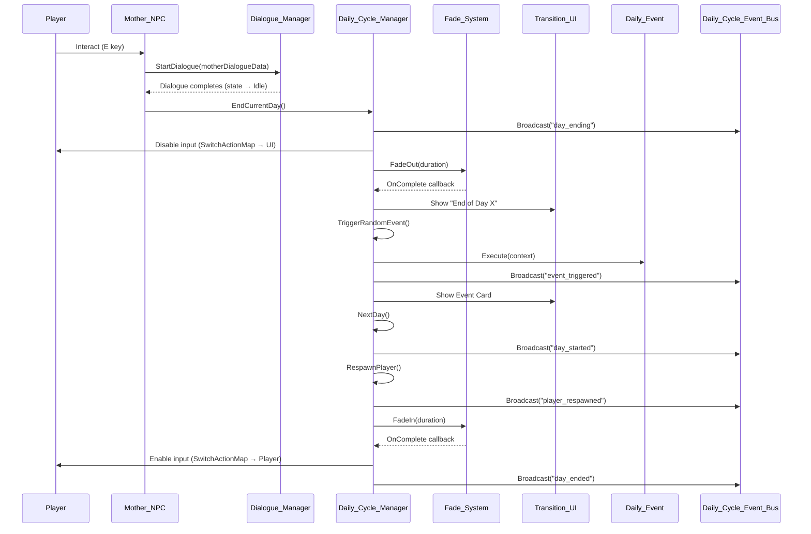
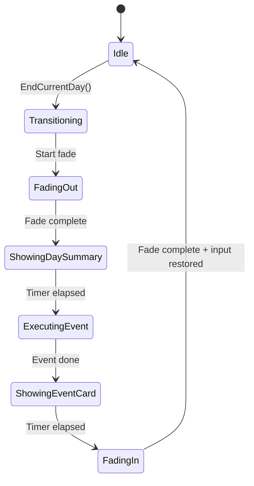

# Design Document: Daily Cycle System

## Overview

The Daily Cycle System is the core gameplay loop orchestrator for Flipit. It manages the progression of in-game days, coordinates the end-of-day transition sequence, executes random daily events for variety, and handles player respawn at the School spawn point each morning.

This system lives in a **new assembly** (`Flipit.DailyCycle`) that depends on `Flipit.Dialogue` and `Flipit.CityTerrain`. No existing assembly references `Flipit.DailyCycle`, ensuring the system is additive and non-breaking.

### Key Design Decisions

| Decision | Rationale |
|----------|-----------|
| New assembly (`Flipit.DailyCycle`) | Isolates the system from existing validated code; prevents circular dependencies |
| Singleton + DontDestroyOnLoad | Matches existing patterns (Combat_System, Dialogue_Manager); survives scene transitions |
| Event-driven dialogue integration | Avoids polling or modifying Flipit.Dialogue; uses existing `Dialogue_Event_Bus` pattern |
| ScriptableObject-based events | Open/Closed Principle — new events added as assets, no code changes to manager |
| Coroutine-based transition sequence | Matches Combat_Transition_UI pattern; straightforward async flow within MonoBehaviour |
| In-memory state only | Requirements explicitly forbid persistence; architecture exposes serializable data for future Save/Load |
| Action delegates on Event Bus | Lightweight pub/sub matching Combat_Event_Bus and Dialogue_Event_Bus patterns |

---

## Architecture

### Assembly Dependency Graph

```
Flipit.Dialogue  (base — no game-assembly dependencies)
       ↑
Flipit.Combat    (depends on Dialogue)
       ↑
Flipit.CityTerrain (depends on Dialogue + Combat)

Flipit.DailyCycle  (depends on Dialogue + CityTerrain)
       ↑
Flipit.DailyCycle.Editor (depends on DailyCycle — Editor only)
```

No existing assembly gains a reference to `Flipit.DailyCycle`. Communication flows **inward** (DailyCycle reads from Dialogue/Combat) and **outward** via its own Event Bus (external systems subscribe to `Daily_Cycle_Event_Bus` without referencing DailyCycle internals).

### System Interaction Diagram



### State Machine

The `Daily_Cycle_Manager` uses a state machine to guard against re-entrant calls:



For implementation simplicity, these states are collapsed into a single `_isTransitioning` boolean guard (matching Combat_System's `CurrentState != Idle` check pattern), with the coroutine itself tracking sub-steps sequentially.

---

## Components and Interfaces

### File Layout

```
Assets/Scripts/DailyCycle/
├── Flipit.DailyCycle.asmdef          # Assembly definition
├── Daily_Cycle_Manager.cs            # Singleton orchestrator
├── Daily_Cycle_Event_Bus.cs          # Static event service
├── Daily_Cycle_State.cs              # Transition state enum
├── Daily_Event.cs                    # Abstract ScriptableObject base
├── Daily_Event_Category.cs           # Category enum
├── Daily_Event_Context.cs            # Interface for event execution context
├── Fade_System.cs                    # Full-screen fade overlay
├── Transition_UI.cs                  # End-of-day text + event card display
├── Mother_NPC.cs                     # Extends NPC_Interactable for end-of-day trigger
└── Daily_Cycle_Save_Data.cs          # Serializable struct for future persistence

Assets/Editor/DailyCycle/
├── Flipit.DailyCycle.Editor.asmdef   # Editor assembly
└── Daily_Cycle_Debug_Tools.cs        # Menu items + custom inspector
```

### Core Interfaces and Contracts

```csharp
namespace Flipit.DailyCycle
{
    /// <summary>
    /// Read-only context passed to Daily_Event.Execute().
    /// Decouples events from manager internals.
    /// </summary>
    public interface IDailyEventContext
    {
        int CurrentDay { get; }
        int PlayerCoins { get; }
        int PlayerFlipits { get; }
    }
}
```

### Component: Daily_Cycle_Manager

```csharp
namespace Flipit.DailyCycle
{
    /// <summary>
    /// Singleton orchestrator for the daily gameplay loop.
    /// Manages day counter, transition sequence, event selection, and player respawn.
    /// </summary>
    public class Daily_Cycle_Manager : MonoBehaviour
    {
        public static Daily_Cycle_Manager Instance { get; private set; }

        // === Serialized Configuration ===
        [SerializeField] private Transform _schoolSpawnPoint;
        [SerializeField] private GameObject _playerGameObject;
        [SerializeField] private PlayerInput _playerInput;
        [SerializeField] private Fade_System _fadeSystem;
        [SerializeField] private Transition_UI _transitionUI;

        [Header("Events")]
        [SerializeField] private Daily_Event[] _eventPool;
        [SerializeField] private float _positiveWeight = 30f;
        [SerializeField] private float _neutralWeight = 50f;
        [SerializeField] private float _negativeWeight = 20f;

        [Header("Timing")]
        [SerializeField] private float _fadeOutDuration = 1.0f;
        [SerializeField] private float _fadeInDuration = 1.0f;
        [SerializeField] private float _daySummaryDuration = 2.5f;
        [SerializeField] private float _eventCardDuration = 3.0f;

        // === Runtime State ===
        private int _dayCounter = 1;
        private bool _isTransitioning = false;
        private string _lastEventName = "None";

        // === Public API ===
        public int CurrentDay => _dayCounter;
        public bool IsTransitioning => _isTransitioning;
        public string LastEventName => _lastEventName;
        public Daily_Cycle_Save_Data SaveData => new Daily_Cycle_Save_Data(_dayCounter, _lastEventName);

        public int GetCurrentDay() => _dayCounter;
        public void EndCurrentDay() { /* starts coroutine */ }
        public void NextDay() { /* increments counter, broadcasts */ }
        public void TriggerRandomEvent() { /* weighted selection + execute */ }
        public void RespawnPlayer() { /* repositions player */ }
    }
}
```

### Component: Daily_Cycle_Event_Bus

```csharp
namespace Flipit.DailyCycle
{
    /// <summary>
    /// Static event service for daily cycle lifecycle events.
    /// External systems subscribe without referencing Daily_Cycle_Manager internals.
    /// </summary>
    public static class Daily_Cycle_Event_Bus
    {
        public static event Action<int> OnDayStarted;        // param: new day number
        public static event Action<int> OnDayEnding;         // param: current day number
        public static event Action<string> OnEventTriggered; // param: event title
        public static event Action<int> OnDayEnded;          // param: completed day number
        public static event Action OnPlayerRespawned;

        public static void BroadcastDayStarted(int day) => OnDayStarted?.Invoke(day);
        public static void BroadcastDayEnding(int day) => OnDayEnding?.Invoke(day);
        public static void BroadcastEventTriggered(string title) => OnEventTriggered?.Invoke(title);
        public static void BroadcastDayEnded(int day) => OnDayEnded?.Invoke(day);
        public static void BroadcastPlayerRespawned() => OnPlayerRespawned?.Invoke();
    }
}
```

### Component: Daily_Event (Abstract ScriptableObject)

```csharp
namespace Flipit.DailyCycle
{
    [CreateAssetMenu(fileName = "New_Daily_Event", menuName = "Flipit/Daily Event")]
    public abstract class Daily_Event : ScriptableObject
    {
        [SerializeField] private string _title;
        [SerializeField] private string _description;
        [SerializeField] private Daily_Event_Category _category;
        [SerializeField] private float _probability = 1.0f;

        public string Title => _title;
        public string Description => _description;
        public Daily_Event_Category Category => _category;
        public float Probability => _probability;

        /// <summary>
        /// Executes the event effect. Returns true if applied successfully.
        /// Implementations MUST NOT destroy/create GameObjects, remove NPCs,
        /// or regenerate the city.
        /// </summary>
        public abstract bool Execute(IDailyEventContext context);
    }
}
```

### Component: Fade_System

```csharp
namespace Flipit.DailyCycle
{
    /// <summary>
    /// Full-screen fade overlay using a CanvasGroup on Screen Space Overlay (sort order 999).
    /// </summary>
    public class Fade_System : MonoBehaviour
    {
        [SerializeField] private CanvasGroup _canvasGroup;

        public void FadeOut(float duration, Action onComplete = null) { /* lerp alpha 0→1 */ }
        public void FadeIn(float duration, Action onComplete = null) { /* lerp alpha 1→0 */ }
    }
}
```

### Component: Transition_UI

```csharp
namespace Flipit.DailyCycle
{
    /// <summary>
    /// Displays "End of Day X" text and Event Card during transitions.
    /// Renders on an overlay Canvas with highest sorting order.
    /// </summary>
    public class Transition_UI : MonoBehaviour
    {
        [SerializeField] private TMP_Text _dayText;
        [SerializeField] private TMP_Text _eventTitleText;
        [SerializeField] private TMP_Text _eventDescriptionText;
        [SerializeField] private GameObject _dayPanel;
        [SerializeField] private GameObject _eventCardPanel;

        public void ShowDaySummary(int dayNumber) { /* activates panel, sets text */ }
        public void HideDaySummary() { /* deactivates panel */ }
        public void ShowEventCard(string title, string description) { /* activates card */ }
        public void HideEventCard() { /* deactivates card */ }
        public void HideAll() { /* hides everything */ }
    }
}
```

### Component: Mother_NPC

```csharp
namespace Flipit.DailyCycle
{
    /// <summary>
    /// Extends NPC_Interactable. After dialogue completes naturally,
    /// triggers the end-of-day transition via Daily_Cycle_Manager.
    /// </summary>
    public class Mother_NPC : NPC_Interactable
    {
        private bool _waitingForDialogueEnd = false;

        public override void Interact()
        {
            base.Interact(); // starts dialogue via existing system
            _waitingForDialogueEnd = true;
            // subscribe to dialogue state change
        }

        // Listens for Dialogue_Manager.CurrentState == Idle after our dialogue
        private void OnDialogueCompleted()
        {
            if (_waitingForDialogueEnd)
            {
                _waitingForDialogueEnd = false;
                Daily_Cycle_Manager.Instance?.EndCurrentDay();
            }
        }
    }
}
```

---

## Data Models

### Daily_Event_Category (Enum)

```csharp
namespace Flipit.DailyCycle
{
    public enum Daily_Event_Category
    {
        Positive,
        Neutral,
        Negative
    }
}
```

### Daily_Cycle_State (Enum)

```csharp
namespace Flipit.DailyCycle
{
    public enum Daily_Cycle_State
    {
        Idle,
        WaitingForCombat,   // Combat in progress, waiting for Idle
        Transitioning       // End-of-day coroutine running
    }
}
```

### Daily_Cycle_Save_Data (Serializable Struct)

```csharp
namespace Flipit.DailyCycle
{
    /// <summary>
    /// Serializable snapshot of daily cycle state for future Save/Load integration.
    /// </summary>
    [System.Serializable]
    public struct Daily_Cycle_Save_Data
    {
        public int DayCounter;
        public string LastEventName;

        public Daily_Cycle_Save_Data(int dayCounter, string lastEventName)
        {
            DayCounter = dayCounter;
            LastEventName = lastEventName;
        }
    }
}
```

### IDailyEventContext (Interface)

```csharp
namespace Flipit.DailyCycle
{
    public interface IDailyEventContext
    {
        int CurrentDay { get; }
        int PlayerCoins { get; }
        int PlayerFlipits { get; }
    }
}
```

### Weighted Random Selection Algorithm

```csharp
// Pseudocode for TriggerRandomEvent
public void TriggerRandomEvent()
{
    if (_eventPool == null || _eventPool.Length == 0)
    {
        Debug.LogWarning("[Daily_Cycle_Manager] No events configured. Skipping.");
        return;
    }

    // 1. Normalize category weights
    float total = _positiveWeight + _neutralWeight + _negativeWeight;
    float normPositive = _positiveWeight / total;
    float normNeutral = _neutralWeight / total;
    // normNegative = 1 - normPositive - normNeutral (implicit)

    // 2. Roll for category
    float roll = UnityEngine.Random.value;
    Daily_Event_Category selectedCategory;
    if (roll < normPositive)
        selectedCategory = Daily_Event_Category.Positive;
    else if (roll < normPositive + normNeutral)
        selectedCategory = Daily_Event_Category.Neutral;
    else
        selectedCategory = Daily_Event_Category.Negative;

    // 3. Filter events by category
    var candidates = _eventPool.Where(e => e != null && e.Category == selectedCategory).ToArray();

    // 4. Fallback to Neutral if empty
    if (candidates.Length == 0)
    {
        candidates = _eventPool.Where(e => e != null && e.Category == Daily_Event_Category.Neutral).ToArray();
        if (candidates.Length == 0) return; // skip
    }

    // 5. Uniform random selection within category
    var selected = candidates[UnityEngine.Random.Range(0, candidates.Length)];

    // 6. Execute
    var context = BuildEventContext();
    bool success = selected.Execute(context);
    _lastEventName = selected.Title;
    Daily_Cycle_Event_Bus.BroadcastEventTriggered(selected.Title);
}
```

### End-of-Day Coroutine Sequence

```csharp
private IEnumerator EndOfDayCoroutine()
{
    _isTransitioning = true;
    Daily_Cycle_Event_Bus.BroadcastDayEnding(_dayCounter);

    // Wait for combat to finish if active
    while (Combat_System.Instance != null && Combat_System.Instance.CurrentState != CombatState.Idle)
        yield return null;

    // Disable player input
    DisablePlayerInput();

    // Fade out
    bool fadeOutComplete = false;
    _fadeSystem.FadeOut(_fadeOutDuration, () => fadeOutComplete = true);
    yield return new WaitUntil(() => fadeOutComplete);

    // Show day summary
    _transitionUI.ShowDaySummary(_dayCounter);
    yield return new WaitForSeconds(_daySummaryDuration);
    _transitionUI.HideDaySummary();

    // Trigger random event
    TriggerRandomEvent();

    // Show event card (if event was executed)
    if (_lastEventName != "None")
    {
        var lastEvent = GetLastExecutedEvent();
        if (lastEvent != null)
        {
            _transitionUI.ShowEventCard(lastEvent.Title, lastEvent.Description);
            yield return new WaitForSeconds(_eventCardDuration);
            _transitionUI.HideEventCard();
        }
    }

    // Advance day + respawn
    NextDay();
    RespawnPlayer();

    // Fade in
    bool fadeInComplete = false;
    _fadeSystem.FadeIn(_fadeInDuration, () => fadeInComplete = true);
    yield return new WaitUntil(() => fadeInComplete);

    // Restore input
    RestorePlayerInput();
    _isTransitioning = false;

    Daily_Cycle_Event_Bus.BroadcastDayEnded(_dayCounter - 1);
}
```

---


## Correctness Properties

*A property is a characteristic or behavior that should hold true across all valid executions of a system — essentially, a formal statement about what the system should do. Properties serve as the bridge between human-readable specifications and machine-verifiable correctness guarantees.*

### Property 1: Day Counter Monotonic Increment

*For any* day counter value N (where N >= 1), calling NextDay SHALL result in GetCurrentDay() returning exactly N + 1, and GetCurrentDay() SHALL always return a value >= 1 regardless of the sequence of operations performed.

**Validates: Requirements 1.2, 1.3, 12.7**

### Property 2: Respawn Positions Player and Broadcasts

*For any* configured School_Spawn_Point transform (position and rotation), calling RespawnPlayer SHALL set the player's position equal to the spawn point's position AND the player's rotation equal to the spawn point's rotation, AND SHALL broadcast a "player_respawned" event via Daily_Cycle_Event_Bus.

**Validates: Requirements 2.1, 12.5**

### Property 3: World Preservation During Day Transition

*For any* day transition (NextDay + RespawnPlayer), the only scene modifications SHALL be: the Day_Counter value, the player GameObject's position/rotation, and daily event effect values (coins, Flipits, movement speed, combat reward multipliers, vendor discount flags). All other GameObjects, NPC transforms, NPC active states, component configurations, and parent-child relationships SHALL remain unchanged.

**Validates: Requirements 2.3, 2.4, 8.1, 8.2, 8.3, 8.4, 8.5**

### Property 4: Transition Idempotency

*For any* state where IsTransitioning is true, calling EndCurrentDay SHALL have no effect — no new coroutine starts, no state changes occur, and the in-progress transition continues uninterrupted.

**Validates: Requirements 3.5, 4.11**

### Property 5: Weighted Category Event Selection

*For any* non-empty event pool and any set of positive category weights (Positive, Neutral, Negative), TriggerRandomEvent SHALL select exactly one event, the selected event's category SHALL match the category chosen by weighted random roll (with normalization to sum 100%), and the event within the chosen category SHALL be selected with uniform probability among all events of that category.

**Validates: Requirements 5.3, 6.1, 6.2, 6.3, 12.3**

### Property 6: Event Execution Preserves World State

*For any* Daily_Event execution, the set of NPCs in the scene SHALL remain unchanged (no NPCs removed, disabled, or duplicated), no City_Generator methods SHALL be called, and all vendor/challenger NPC_Interactable components SHALL remain enabled.

**Validates: Requirements 7.1, 7.2, 7.3**

### Property 7: Negative Event Resource Loss Bounded

*For any* Negative-category Daily_Event, resource losses (coins, Flipits, consumables) SHALL not exceed the configured maximum threshold per resource type, AND any temporary debuff duration SHALL not exceed the configured maximum duration (default ≤ 30 seconds).

**Validates: Requirements 7.5**

### Property 8: Temporary Effects Reset on New Day

*For any* temporary effect applied by a Daily_Event (movement speed reduction, combat reward multiplier, vendor discount), beginning a new day SHALL reset that effect to its default value, such that no debuff persists across day boundaries.

**Validates: Requirements 7.6**

### Property 9: Fade System Reaches Target and Invokes Callback

*For any* valid duration in [0.1, 5.0] seconds, FadeOut SHALL interpolate alpha from 0 to 1 and invoke the completion callback exactly once upon reaching alpha 1.0. Similarly, FadeIn SHALL interpolate alpha from 1 to 0 and invoke the completion callback exactly once upon reaching alpha 0.0.

**Validates: Requirements 10.1, 10.2, 10.3**

### Property 10: Event Card Displays Correct Data

*For any* Daily_Event with a title and description, the Transition_UI.ShowEventCard method SHALL receive and display the exact title and description from that event asset, with no truncation below the maximum character limits (60 chars title, 200 chars description).

**Validates: Requirements 9.2**

### Property 11: Event Bus Lifecycle Event Ordering

*For any* complete end-of-day transition, the Daily_Cycle_Event_Bus SHALL broadcast events in this exact order: "day_ending" → "event_triggered" (if event exists) → "day_started" → "player_respawned" → "day_ended". No event in the sequence SHALL fire before the previous one completes.

**Validates: Requirements 12.8**

### Property 12: Input Disabled Throughout Transition

*For any* end-of-day transition from the moment EndCurrentDay begins to the moment the fade-in completes, the PlayerInput action map SHALL remain set to "UI" (blocking all Player-map actions including movement and interaction), and SHALL only switch back to "Player" after the final fade-in callback fires.

**Validates: Requirements 4.1, 4.9, 4.10**

---

## Error Handling

| Scenario | Behavior |
|----------|----------|
| School_Spawn_Point null | Log `[Daily_Cycle_Manager] School Spawn Point not assigned. Skipping respawn.` — player position unchanged |
| Player GameObject null | Log `[Daily_Cycle_Manager] Player reference not assigned. Skipping respawn.` — no position change |
| Event pool empty | Log `[Daily_Cycle_Manager] No events configured. Skipping event execution.` — transition continues |
| Selected category has no events | Fall back to Neutral category; if also empty, skip event entirely |
| EndCurrentDay called during transition | Log `[Daily_Cycle_Manager] Transition already in progress. Ignoring duplicate call.` — no action |
| Daily_Event.Execute throws exception | Catch, log `[Daily_Cycle_Manager] Event '{title}' threw exception: {message}` — transition continues |
| Fade_System reference null | Log error, skip fade animations, proceed with instant transitions |
| Transition_UI reference null | Log warning, skip UI display, proceed with logic |
| Combat_System active during end-of-day | Wait in coroutine until `Combat_System.CurrentState == CombatState.Idle` |
| PlayerInput reference null | Log warning, skip input map switching |
| Dialogue_Manager.Instance null | Mother_NPC logs warning, does not call EndCurrentDay |

All error paths follow the principle: **log descriptively, never throw, never break the transition flow**.

---

## Testing Strategy

### Unit Tests (Example-Based)

Unit tests cover specific scenarios, edge cases, and integration points:

- **Singleton**: Only one Instance survives; duplicates destroyed
- **Initialization**: Day counter starts at 1; fade system alpha starts at 0
- **Edge cases**: Null references gracefully handled; empty event pool handled
- **Sequence**: Transition steps execute in correct order
- **Integration**: Mother_NPC triggers EndCurrentDay on dialogue completion; cancelled dialogue does not trigger
- **Combat guard**: Transition waits for combat to finish

### Property-Based Tests

Property tests validate universal correctness across generated inputs. The project uses `com.unity.test-framework` (NUnit).  
PBT will be implemented using **NUnit with a custom `[Repeat(100)]` attribute** combined with randomized setup per iteration (Unity Test Framework does not bundle a full PBT library, so we generate random inputs manually within each test and run 100+ iterations).

**Configuration:**
- Minimum 100 iterations per property test
- Each test tagged with property reference comment
- Random seed logged on failure for reproduction

**Property test mapping:**

| Property | Test Focus | Generator Strategy |
|----------|-----------|-------------------|
| 1: Day Counter Increment | Random starting day (1–9999), call NextDay | Random int in range |
| 2: Respawn Position | Random Vector3 position + Quaternion rotation for spawn point | Random floats |
| 3: World Preservation | Random scene state snapshot before/after transition | Record transforms |
| 4: Transition Idempotency | Random timing for duplicate EndCurrentDay calls | Random delays |
| 5: Weighted Selection | Random weights (0.01–100 each), random pool sizes | Random floats + event lists |
| 6: Event World Safety | Random concrete event subclass executions | Mock events with random params |
| 7: Negative Loss Bounds | Random loss values against configurable thresholds | Random ints/floats |
| 8: Temp Effect Reset | Random effect types and values, verify cleared | Random effect configs |
| 9: Fade Completion | Random durations in [0.1, 5.0] | Random floats |
| 10: Event Card Display | Random title/description strings within char limits | Random strings |
| 11: Event Bus Ordering | Random day numbers and event configurations | Random ints + events |
| 12: Input During Transition | Random transition timing, verify action map | Random frame counts |

### Integration Tests

- Full end-of-day sequence in Play Mode (start to finish)
- Mother_NPC dialogue → EndCurrentDay → complete transition
- Editor debug tools functional in Editor mode

### Tag Format

```csharp
// Feature: daily-cycle-system, Property 1: Day Counter Monotonic Increment
[Test, Repeat(100)]
public void Property1_DayCounterIncrements_ForAnyStartValue() { ... }
```
