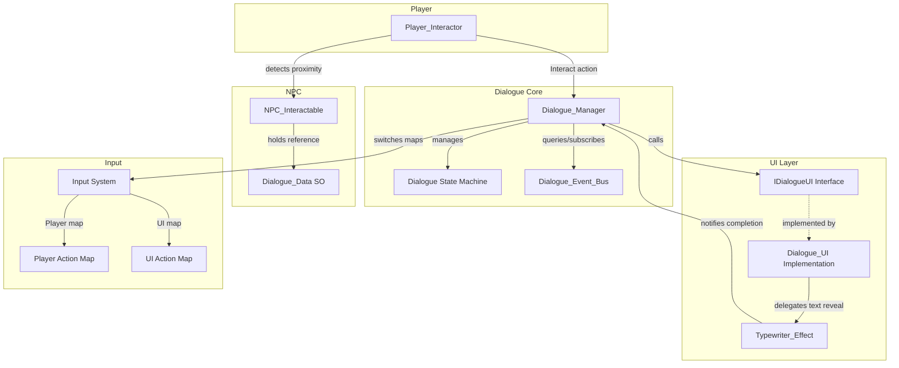
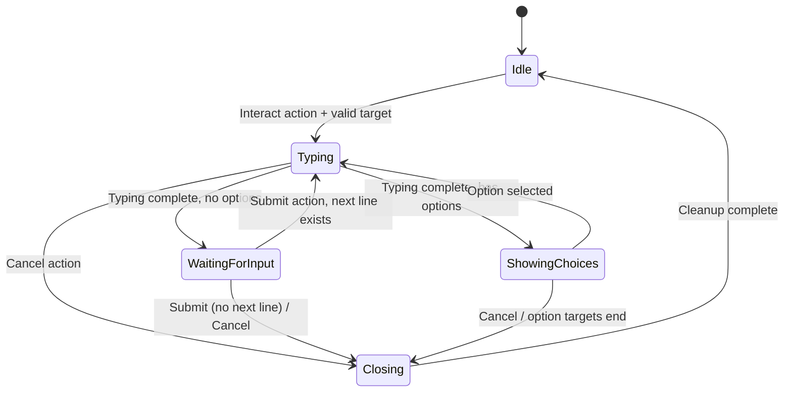

# Design Document: Dialogue System

## Overview

The Dialogue System is a data-driven conversational framework for Flipit that enables player-NPC interactions through proximity detection, typewriter text display, branching choices, and event-driven option filtering. The system is built on Unity 6 with URP, using Canvas-based uGUI with TextMeshPro for rendering, the new Input System for input map switching, and ScriptableObjects for dialogue authoring.

The architecture follows a state-machine-driven approach where a central `Dialogue_Manager` orchestrates all dialogue flow through well-defined states (Idle → Typing → WaitingForInput/ShowingChoices → Closing → Idle). The UI is abstracted behind an `IDialogueUI` interface to allow alternative implementations without modifying core logic.

Key design goals:
- **Data-driven**: All dialogue content lives in ScriptableObjects — no hardcoded conversations
- **Decoupled**: UI abstracted via interface; event bus decouples game progression from dialogue logic
- **Deterministic**: State machine enforces valid transitions with rejection + logging for invalid attempts
- **Responsive**: Typewriter effect with skip support; single-frame input map switches for seamless transitions

## Architecture



### Execution Flow



## Components and Interfaces

### IDialogueUI (Interface)

The abstraction layer between the Dialogue_Manager and any UI implementation.

```csharp
public interface IDialogueUI
{
    void Show();
    void Hide(Action onComplete);
    void SetSpeakerName(string speakerName);
    void SetDialogueText(string text);
    void SetVisibleCharacterCount(int count);
    void ShowAdvanceIndicator(bool visible);
    void ShowTypingIndicator(bool visible);
    void ShowOptions(List<DialogueOption> options, Action<int> onOptionSelected);
    void HideOptions();
    void ClearText();
}
```

### Dialogue_Manager (MonoBehaviour, Singleton)

Central orchestrator responsible for:
- Maintaining the `DialogueState` enum and enforcing valid transitions
- Coordinating between Player_Interactor, IDialogueUI, Typewriter_Effect, and Dialogue_Event_Bus
- Switching Input Action Maps (Player ↔ UI)
- Managing CurrentLineIndex and dialogue progression
- Subscribing to Dialogue_Event_Bus notifications during active sessions

```csharp
public class Dialogue_Manager : MonoBehaviour
{
    [SerializeField] private MonoBehaviour dialogueUIComponent; // Must implement IDialogueUI
    [SerializeField] private PlayerInput playerInput;

    public DialogueState CurrentState { get; private set; }
    public int CurrentLineIndex { get; private set; }

    public bool TryTransition(DialogueState targetState);
    public void StartDialogue(Dialogue_Data data);
    public void AdvanceLine();
    public void SelectOption(int optionIndex);
    public void CloseDialogue();
    public void OnTypewriterComplete();
}
```

### Player_Interactor (MonoBehaviour)

Attached to the player GameObject. Uses Physics2D.OverlapCircleAll (top-down game) to detect NPC_Interactable components within range each FixedUpdate cycle.

```csharp
public class Player_Interactor : MonoBehaviour
{
    [SerializeField, Min(0.1f)] private float interactionRadius = 2.0f;
    
    public NPC_Interactable CurrentTarget { get; private set; }
    
    // Called by Input System Interact action
    public void OnInteract(InputAction.CallbackContext context);
}
```

**Detection strategy**: Each FixedUpdate, performs a 2D overlap circle centered on the player's position. Filters results for NPC_Interactable, selects nearest by transform distance. Clears target when no NPC_Interactable is within radius.

### NPC_Interactable (MonoBehaviour)

Simple component placed on NPC GameObjects.

```csharp
public class NPC_Interactable : MonoBehaviour
{
    [SerializeField] private Dialogue_Data dialogueData;
    
    public Dialogue_Data DialogueData => dialogueData;
    public bool HasValidDialogue => dialogueData != null && dialogueData.Lines.Count > 0;
}
```

### Typewriter_Effect (MonoBehaviour)

Handles character-by-character text reveal using TMP's `maxVisibleCharacters`.

```csharp
public class Typewriter_Effect : MonoBehaviour
{
    [SerializeField, Min(0.01f)] private float characterDelay = 0.03f;
    
    public event Action OnTypingComplete;
    
    public void StartTyping(string text, IDialogueUI ui);
    public void SkipToEnd();
    public void Stop();
}
```

**Implementation**: Uses a coroutine that increments `maxVisibleCharacters` each `characterDelay` seconds via `WaitForSeconds`. Skip sets `maxVisibleCharacters` to total character count, stops the coroutine, and fires `OnTypingComplete`.

### Dialogue_Event_Bus (Static Class)

Global event tracking service. Uses a `HashSet<string>` for O(1) lookup.

```csharp
public static class Dialogue_Event_Bus
{
    public static event Action<string> OnEventActivated;
    public static event Action<string> OnEventDeactivated;
    
    public static void ActivateEvent(string eventId);
    public static void DeactivateEvent(string eventId);
    public static bool IsEventActive(string eventId);
    public static void ClearAll();
}
```

### Dialogue_UI (MonoBehaviour implementing IDialogueUI)

The concrete Canvas-based uGUI implementation using TextMeshPro.

```csharp
public class Dialogue_UI : MonoBehaviour, IDialogueUI
{
    [SerializeField] private Canvas dialogueCanvas;
    [SerializeField] private TMP_Text speakerNameText;
    [SerializeField] private TMP_Text dialogueText;
    [SerializeField] private GameObject advanceIndicator;
    [SerializeField] private GameObject typingIndicator;
    [SerializeField] private DialogueOptionButton[] optionButtons; // max 4
    
    // IDialogueUI implementation
}
```

### DialogueOptionButton (MonoBehaviour)

A reusable component for each option button in the choice UI.

```csharp
public class DialogueOptionButton : MonoBehaviour
{
    [SerializeField] private TMP_Text labelText;
    [SerializeField] private Image highlightImage;
    
    public void Setup(string text, bool highlighted);
    public void SetHighlighted(bool highlighted);
}
```

## Data Models

### Dialogue_Data (ScriptableObject)

```csharp
[CreateAssetMenu(fileName = "NewDialogue", menuName = "Flipit/Dialogue Data")]
public class Dialogue_Data : ScriptableObject
{
    [SerializeField] private string speakerName;
    [SerializeField] private List<Dialogue_Line> lines = new();

    public string SpeakerName => speakerName;
    public IReadOnlyList<Dialogue_Line> Lines => lines;
}
```

### Dialogue_Line (Serializable struct)

```csharp
[System.Serializable]
public struct Dialogue_Line
{
    [SerializeField, TextArea(2, 5)] private string text;
    [SerializeField] private List<Dialogue_Option> options;

    public string Text => text;
    public IReadOnlyList<Dialogue_Option> Options => options ?? new List<Dialogue_Option>();
    public bool HasOptions => options != null && options.Count > 0;
}
```

### Dialogue_Option (Serializable struct)

```csharp
[System.Serializable]
public struct Dialogue_Option
{
    [SerializeField] private string displayText;
    [SerializeField] private string requiredEventId;
    [SerializeField, Min(0)] private int targetLineIndex;

    public string DisplayText => displayText;
    public string RequiredEventId => requiredEventId;
    public int TargetLineIndex => targetLineIndex;
    public bool HasRequiredEvent => !string.IsNullOrEmpty(requiredEventId);
}
```

**Note on target line index**: A value of -1 or any index >= `Lines.Count` signals dialogue termination (transition to Closing). The `Min(0)` attribute on the serialized field prevents negative values in the Inspector; the -1 sentinel is only used when set programmatically or via a custom editor that allows it.

### DialogueState (Enum)

```csharp
public enum DialogueState
{
    Idle,
    Typing,
    WaitingForInput,
    ShowingChoices,
    Transitioning,
    Closing
}
```

### State Transition Table

| From | Valid Targets |
|------|-------------|
| Idle | Typing |
| Typing | WaitingForInput, ShowingChoices, Closing |
| WaitingForInput | Typing, Closing |
| ShowingChoices | Typing, Closing |
| Closing | Idle |
| Transitioning | (reserved for future animation states) |


## Correctness Properties

*A property is a characteristic or behavior that should hold true across all valid executions of a system — essentially, a formal statement about what the system should do. Properties serve as the bridge between human-readable specifications and machine-verifiable correctness guarantees.*

### Property 1: Proximity target is nearest NPC within radius or null

*For any* player position, any set of NPC positions, and any valid interaction radius (≥ 0.1), the Player_Interactor's current target SHALL be the NPC_Interactable with the minimum distance to the player among those within the radius, or null if no NPC_Interactable is within the radius.

**Validates: Requirements 1.1, 1.2, 1.3**

### Property 2: Interaction radius clamping

*For any* float value assigned to the interaction radius, the effective radius SHALL be max(value, 0.1).

**Validates: Requirements 1.4, 1.5**

### Property 3: State machine transition validity

*For any* current DialogueState and any target DialogueState, TryTransition SHALL return true and update the state if and only if the (current, target) pair exists in the valid transition set {(Idle→Typing), (Typing→WaitingForInput), (Typing→ShowingChoices), (Typing→Closing), (WaitingForInput→Typing), (WaitingForInput→Closing), (ShowingChoices→Typing), (ShowingChoices→Closing), (Closing→Idle)}. For all other pairs, TryTransition SHALL return false and the state SHALL remain unchanged.

**Validates: Requirements 10.2, 10.3, 10.4, 10.5, 10.6, 10.7, 10.8**

### Property 4: Typewriter skip reveals all characters and fires completion

*For any* non-empty string being typed by the Typewriter_Effect, invoking skip at any point during the reveal SHALL set the visible character count equal to the total character count of the string AND fire the OnTypingComplete notification exactly once.

**Validates: Requirements 3.3, 3.4, 3.5**

### Property 5: Post-typing state depends on options presence

*For any* Dialogue_Line, when the Typewriter_Effect notifies completion, the Dialogue_Manager SHALL transition to ShowingChoices if the line has available options (after filtering), or to WaitingForInput if the line has no available options.

**Validates: Requirements 4.1, 5.1**

### Property 6: Dialogue advancement or closing on submit

*For any* dialogue session in WaitingForInput state, performing Submit SHALL increment CurrentLineIndex and transition to Typing if a subsequent Dialogue_Line exists, or transition to Closing if no subsequent line exists.

**Validates: Requirements 4.3, 4.4**

### Property 7: Option filtering by event bus

*For any* set of Dialogue_Options and any set of active event IDs on the Dialogue_Event_Bus, a Dialogue_Option SHALL be included in the available options list if and only if its required event ID is empty/null OR the required event ID exists in the active events set.

**Validates: Requirements 6.1, 6.2, 6.3, 6.4**

### Property 8: All options filtered yields WaitingForInput

*For any* Dialogue_Line where all Dialogue_Options have required event IDs that are not active on the Dialogue_Event_Bus, the Dialogue_Manager SHALL treat the line as having no options and transition to WaitingForInput.

**Validates: Requirements 6.5**

### Property 9: Maximum four displayed options

*For any* Dialogue_Line with N available options after filtering where N > 4, the Dialogue_UI SHALL display exactly 4 options.

**Validates: Requirements 6.8, 5.2**

### Property 10: Choice navigation wrapping

*For any* set of displayed options (count 1–4) and any sequence of Navigate Up/Down actions, the highlighted index SHALL wrap from the last option to the first on Navigate Down, and from the first to the last on Navigate Up, such that highlighted index = (current + direction) mod option_count.

**Validates: Requirements 5.3**

### Property 11: Option selection navigates to target line or closes

*For any* selected Dialogue_Option, if the target line index is within [0, Lines.Count), the Dialogue_Manager SHALL set CurrentLineIndex to that target and transition to Typing. If the target line index is -1 or >= Lines.Count, the Dialogue_Manager SHALL transition to Closing.

**Validates: Requirements 5.4, 5.5**

### Property 12: Event bus set semantics

*For any* sequence of ActivateEvent and DeactivateEvent calls with arbitrary event ID strings, the Dialogue_Event_Bus raised events collection SHALL behave as a mathematical set: each event ID appears at most once, IsEventActive returns true iff the ID is in the set, and ClearAll results in an empty set.

**Validates: Requirements 9.1, 9.2, 9.3, 9.4, 9.6**

### Property 13: Cancel from active states transitions to Closing

*For any* active dialogue state (Typing, WaitingForInput, or ShowingChoices), performing the Cancel action SHALL transition the Dialogue_State to Closing.

**Validates: Requirements 7.2**

### Property 14: HasOptions reflects list content

*For any* Dialogue_Line with an options list, the HasOptions property SHALL return true if and only if the options list contains one or more entries.

**Validates: Requirements 8.6**

## Error Handling

### Guard Conditions

| Scenario | Behavior |
|----------|----------|
| Interact with null/empty Dialogue_Data | Remain Idle, no session started (Req 2.5) |
| No IDialogueUI assigned at session start | Log warning, remain Idle (Req 11.4) |
| Invalid state transition attempted | Reject, log warning with current/target states, return false (Req 10.7, 10.8) |
| Cancel during Closing state | Ignore input, remain in Closing (Req 7.3) |
| Target line index out of bounds | Treat as dialogue end, transition to Closing (Req 5.5) |

### Logging Strategy

- **Warnings**: Invalid state transitions, missing UI references, null dialogue data interactions
- **Errors**: None expected in normal operation; all failure paths are handled gracefully
- Use `Debug.LogWarning` with contextual messages including current state and attempted action

### Null Safety

- `NPC_Interactable.DialogueData` may be null — checked via `HasValidDialogue` before session start
- `Dialogue_Line.Options` may be null — `Options` property returns empty list fallback
- `Dialogue_Option.RequiredEventId` may be null/empty — treated as "no requirement" (always available)
- `IDialogueUI` reference checked before every session start

## Testing Strategy

### Property-Based Testing

**Library**: NUnit with custom generators (Unity Test Framework does not natively support PBT, so we implement lightweight random generators using `System.Random` with seed control for reproducibility).

**Configuration**:
- Minimum 100 iterations per property test
- Seed-based reproducibility for failure investigation
- Each test tagged with: `Feature: dialogue-system, Property {N}: {description}`

**Properties to implement as PBT**:
1. Proximity target selection (Property 1)
2. Radius clamping (Property 2)
3. State machine transition validity (Property 3)
4. Typewriter skip + completion (Property 4)
5. Post-typing state routing (Property 5)
6. Advancement/closing logic (Property 6)
7. Option filtering by event bus (Property 7)
8. All-filtered fallback (Property 8)
9. Max 4 options cap (Property 9)
10. Navigation wrapping (Property 10)
11. Option selection target navigation (Property 11)
12. Event bus set semantics (Property 12)
13. Cancel transitions (Property 13)
14. HasOptions correctness (Property 14)

### Unit Tests (Example-Based)

- Default configuration values (radius = 2.0, delay = 0.03)
- Initial state is Idle on Dialogue_Manager creation
- Input map switches to UI on session start, back to Player on close
- UI visibility toggled correctly on show/hide
- Advance indicator visible in WaitingForInput state
- Speaker name displayed matches Dialogue_Data
- Dynamic re-filtering updates UI when event bus fires (Req 6.6)
- Auto-select when re-filtering reduces to one option (Req 6.7)
- Session start rejected with null Dialogue_Data
- Session start rejected with no IDialogueUI assigned

### Integration Tests

- Full dialogue flow: Interact → read lines → close
- Branching: select option → navigate to target line → continue
- Event-driven filtering: activate event mid-dialogue → option appears
- Input map switching verified via PlayerInput component state
- Typewriter timing verified with simulated time advancement

### Test Organization

```
Assets/
  Tests/
    EditMode/
      DialogueStateMachineTests.cs    (Property 3, 13)
      DialogueEventBusTests.cs        (Property 12)
      OptionFilteringTests.cs         (Property 7, 8, 9)
      DialogueDataTests.cs            (Property 14)
      NavigationWrappingTests.cs      (Property 10)
      ProximityDetectionTests.cs      (Property 1, 2)
      DialogueAdvancementTests.cs     (Property 5, 6, 11)
      TypewriterEffectTests.cs        (Property 4)
    PlayMode/
      DialogueIntegrationTests.cs
      InputMapSwitchingTests.cs
```
