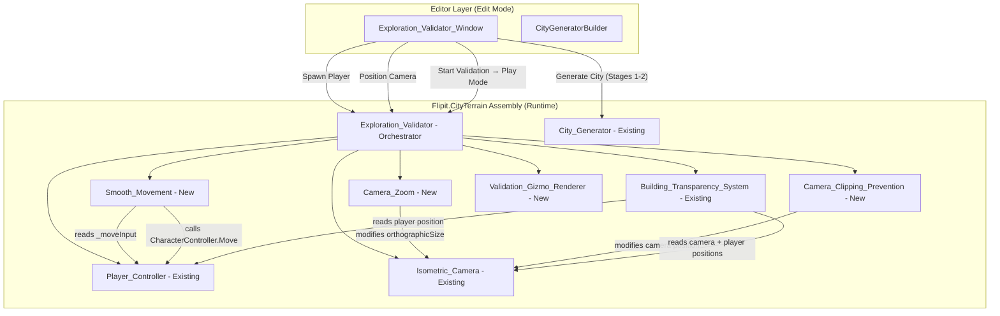
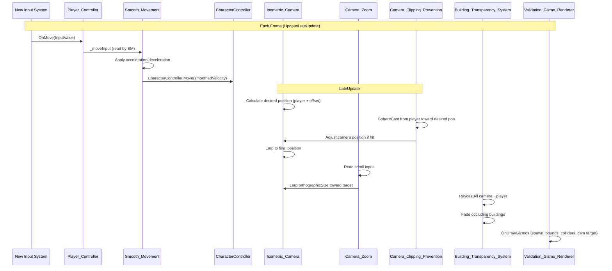
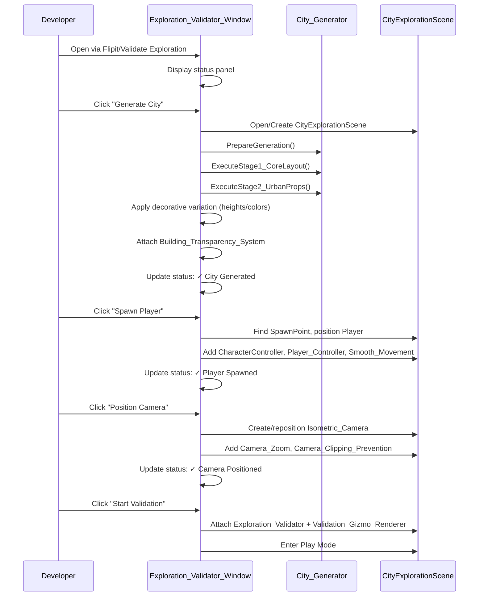

# Design Document: Exploration Validation

## Overview

This design describes a validation scene system for Flipit's procedurally generated city. The system allows developers to test exploration mechanics (movement, camera, building transparency, collisions) in isolation, without NPC, combat, or dialogue systems. It extends the existing `Player_Controller`, `Isometric_Camera`, and `Building_Transparency_System` with smooth movement, zoom, and clipping prevention, then provides an Editor Window to orchestrate the full validation flow.

**Key Design Decisions:**
- **Composition over inheritance**: New behaviors (Smooth_Movement, Camera_Zoom, Camera_Clipping_Prevention) are separate MonoBehaviours that compose with existing components rather than subclassing them
- **Stages 1-2 only**: Validation generation uses only Core Layout and Urban Props, manually applying transparency and decorative variation to maintain visual quality without NPC/encounter systems
- **Editor-driven orchestration**: The Exploration_Validator_Window handles scene setup in Edit Mode; the Exploration_Validator MonoBehaviour orchestrates runtime validation in Play Mode
- **Gizmo visualization**: A dedicated gizmo renderer provides debug visualization in both Edit and Play modes

## Architecture

### System Architecture Diagram



### Component Interaction Flow (Runtime)



### Editor Window Flow (Edit Mode)



## Components and Interfaces

### File Structure

```
Assets/
├── Scripts/
│   └── CityTerrain/
│       └── Runtime/
│           ├── Player_Controller.cs          (existing — unchanged)
│           ├── Smooth_Movement.cs            (NEW)
│           ├── Isometric_Camera.cs           (existing — unchanged)
│           ├── Camera_Zoom.cs                (NEW)
│           ├── Camera_Clipping_Prevention.cs (NEW)
│           ├── Building_Transparency_System.cs (existing — unchanged)
│           ├── Exploration_Validator.cs      (NEW)
│           └── Validation_Gizmo_Renderer.cs  (NEW)
├── Editor/
│   └── ExplorationValidatorWindow.cs         (NEW)
└── Scenes/
    └── CityExplorationScene.unity            (existing)
```

### Component Signatures

#### Smooth_Movement (New MonoBehaviour)

```csharp
namespace Flipit.CityTerrain
{
    /// <summary>
    /// Adds acceleration/deceleration to Player_Controller movement.
    /// Reads raw input from Player_Controller and applies smoothed
    /// velocity through CharacterController.Move each frame.
    /// </summary>
    [RequireComponent(typeof(Player_Controller))]
    [RequireComponent(typeof(CharacterController))]
    public class Smooth_Movement : MonoBehaviour
    {
        [SerializeField] private float _maxSpeed = 5f;
        [SerializeField] private float _acceleration = 20f;
        [SerializeField] private float _deceleration = 15f;
        [SerializeField] private float _deadZoneThreshold = 0.01f;

        private CharacterController _cc;
        private Vector3 _currentVelocity;
        private Vector2 _moveInput;
        private float _verticalVelocity;
        private const float Gravity = -9.81f;

        // Public read-only access for testing
        public Vector3 CurrentVelocity => _currentVelocity;
        public float MaxSpeed => _maxSpeed;

        private void Awake();
        private void Update();

        /// <summary>
        /// Input System callback — replaces Player_Controller's OnMove
        /// when Smooth_Movement is active.
        /// </summary>
        public void OnMove(InputValue value);
    }
}
```

#### Camera_Zoom (New MonoBehaviour)

```csharp
namespace Flipit.CityTerrain
{
    /// <summary>
    /// Adjustable zoom for the isometric camera via mouse scroll wheel.
    /// Modifies Camera.orthographicSize with clamping and smooth lerp.
    /// </summary>
    [RequireComponent(typeof(Camera))]
    public class Camera_Zoom : MonoBehaviour
    {
        [SerializeField] private float _zoomStep = 0.5f;
        [SerializeField] private float _minOrthoSize = 3f;
        [SerializeField] private float _maxOrthoSize = 20f;
        [SerializeField] private float _smoothDuration = 0.15f;

        private Camera _camera;
        private float _targetOrthoSize;

        // Public read-only access for testing
        public float TargetOrthoSize => _targetOrthoSize;
        public float MinOrthoSize => _minOrthoSize;
        public float MaxOrthoSize => _maxOrthoSize;

        private void Awake();
        private void Update();

        /// <summary>
        /// Input System callback for the Scroll action (Mouse ScrollWheel).
        /// </summary>
        public void OnScroll(InputValue value);
    }
}
```

#### Camera_Clipping_Prevention (New MonoBehaviour)

```csharp
namespace Flipit.CityTerrain
{
    /// <summary>
    /// Prevents camera from clipping through buildings by using
    /// SphereCast along the camera's back-vector from the player.
    /// Adjusts camera position when geometry is detected.
    /// </summary>
    public class Camera_Clipping_Prevention : MonoBehaviour
    {
        [SerializeField] private Transform _player;
        [SerializeField] private float _sphereCastRadius = 0.3f;
        [SerializeField] private float _offsetFromHit = 0.5f;
        [SerializeField] private float _smoothSpeed = 5f;
        [SerializeField] private LayerMask _cityGeometryLayer;

        private Isometric_Camera _isoCam;
        private float _currentFollowDistance;

        private void Awake();
        private void LateUpdate(); // Runs after Isometric_Camera.LateUpdate
    }
}
```

#### Validation_Gizmo_Renderer (New MonoBehaviour)

```csharp
namespace Flipit.CityTerrain
{
    /// <summary>
    /// Draws debug gizmos in the Scene view for validation:
    /// - Green sphere at PlayerSpawn
    /// - Yellow wireframe rectangle for Navigation_Bounds
    /// - Cyan wireframe cubes for building BoxColliders
    /// - Magenta sphere at camera target position
    ///
    /// Uses OnDrawGizmos for edit-mode visibility and
    /// OnDrawGizmosSelected for play-mode detail.
    /// </summary>
    public class Validation_Gizmo_Renderer : MonoBehaviour
    {
        [SerializeField] private Transform _spawnPoint;
        [SerializeField] private Vector2 _navigationBounds; // (width, depth) in world units
        [SerializeField] private Transform _cameraTarget;
        [SerializeField] private LayerMask _cityGeometryLayer;

        // Public for Editor configuration
        public Vector2 NavigationBounds
        {
            get => _navigationBounds;
            set => _navigationBounds = value;
        }

        private void OnDrawGizmos();         // spawn + bounds (always visible)
        private void OnDrawGizmosSelected(); // buildings + camera target (when selected)
    }
}
```

#### Exploration_Validator (New MonoBehaviour — Orchestrator)

```csharp
namespace Flipit.CityTerrain
{
    /// <summary>
    /// Runtime orchestrator for the validation scene. Initializes on Awake:
    /// - Locates PlayerSpawn and positions Player_Controller
    /// - Verifies all required components are present
    /// - Enables validation gizmos
    /// Does NOT instantiate NPCs, combat, or dialogue systems.
    /// </summary>
    public class Exploration_Validator : MonoBehaviour
    {
        [SerializeField] private float _moveSpeed = 5f;
        [SerializeField] private float _acceleration = 20f;
        [SerializeField] private float _deceleration = 15f;
        [SerializeField] private float _cameraSmoothSpeed = 5f;
        [SerializeField] private float _cameraFollowOffset = 10f;
        [SerializeField] private float _cameraOrthoSize = 8f;

        private bool _isInitialized;

        public bool IsInitialized => _isInitialized;

        private void Awake(); // Locate spawn, position player, validate components
        private bool LocateAndSpawnPlayer();
        private bool ValidateComponents();
    }
}
```

#### Exploration_Validator_Window (New EditorWindow)

```csharp
// Located in Assets/Editor/ExplorationValidatorWindow.cs
using UnityEditor;
using UnityEngine;
using Flipit.CityTerrain;

/// <summary>
/// Editor window accessible from "Flipit/Validate Exploration".
/// Provides buttons for: Generate City, Spawn Player, Position Camera,
/// Start Validation. Displays status labels for each step.
/// </summary>
public class ExplorationValidatorWindow : EditorWindow
{
    private const string ScenePath = "Assets/Scenes/CityExplorationScene.unity";

    private bool _cityGenerated;
    private bool _playerSpawned;
    private bool _cameraPositioned;

    [MenuItem("Flipit/Validate Exploration")]
    public static void ShowWindow();

    private void OnGUI();

    private void GenerateCity();    // Stages 1-2 + variation + transparency
    private void SpawnPlayer();     // Locate spawn, create player with components
    private void PositionCamera();  // Create camera with zoom + clipping
    private void StartValidation(); // Attach orchestrator, enter Play Mode

    private bool ValidateSceneExists();
}
```

### Key Algorithms

#### Smooth Movement Algorithm (per frame)

```
Input: _moveInput (Vector2 from Input System), _acceleration, _deceleration, _maxSpeed, deltaTime
Output: smoothed velocity applied via CharacterController.Move

1. Calculate desired direction: desiredDir = normalize(moveInput.x, 0, moveInput.y)
2. Calculate desired speed:
   - If moveInput magnitude > 0: desiredSpeed = _maxSpeed
   - Else: desiredSpeed = 0

3. Calculate current horizontal speed: currentSpeed = horizontalVelocity.magnitude

4. Accelerate/decelerate:
   - If desiredSpeed > currentSpeed:
       currentSpeed = MoveTowards(currentSpeed, desiredSpeed, _acceleration * deltaTime)
   - Else:
       currentSpeed = MoveTowards(currentSpeed, desiredSpeed, _deceleration * deltaTime)

5. Dead zone check:
   - If currentSpeed < _deadZoneThreshold: currentSpeed = 0

6. Apply to velocity vector:
   - If moveInput magnitude > 0: horizontalVelocity = desiredDir * currentSpeed
   - Else: horizontalVelocity = horizontalVelocity.normalized * currentSpeed

7. Apply gravity:
   - If grounded: verticalVelocity = -0.5f
   - Else: verticalVelocity += Gravity * deltaTime

8. Final move: CharacterController.Move((horizontalVelocity + Vector3.up * verticalVelocity) * deltaTime)
```

#### Camera Zoom Algorithm (per frame)

```
Input: scrollDelta (float from Input System), _zoomStep, _minOrthoSize, _maxOrthoSize, _smoothDuration
Output: smoothly interpolated orthographicSize

1. On scroll input:
   - _targetOrthoSize -= scrollDelta.y * _zoomStep
   - _targetOrthoSize = Clamp(_targetOrthoSize, _minOrthoSize, _maxOrthoSize)

2. Each frame:
   - lerpSpeed = (1f / _smoothDuration) * deltaTime
   - camera.orthographicSize = MoveTowards(camera.orthographicSize, _targetOrthoSize, lerpSpeed)
```

#### Camera Clipping Prevention Algorithm (per frame, LateUpdate)

```
Input: playerPos, desiredCameraPos, _sphereCastRadius, _offsetFromHit, _cityGeometryLayer
Output: adjusted camera position

1. direction = desiredCameraPos - playerPos
2. maxDistance = direction.magnitude
3. hit = SphereCast(playerPos, _sphereCastRadius, direction.normalized, maxDistance, _cityGeometryLayer)

4. If hit:
   - clippedDistance = hit.distance - _offsetFromHit
   - clippedDistance = Max(clippedDistance, 1.0f)  // minimum 1 unit from player
   - adjustedPos = playerPos + direction.normalized * clippedDistance
   - camera.position = Lerp(camera.position, adjustedPos, _smoothSpeed * deltaTime)
5. Else:
   - camera.position stays at desired (normal Isometric_Camera follow)
```

#### Validation Generation Pipeline (Editor-driven)

```
Input: City_Generator with City_Config
Output: City with only Stages 1-2 + manual decorative variation + transparency

1. PrepareGeneration() — validate config, initialize seed, clear scene
2. ExecuteStage1_CoreLayout() — grid, ground, streets, sidewalks, buildings, landmarks, player, camera
3. ExecuteStage2_UrbanProps() — trees, cars, lampposts, benches, trash cans
4. SKIP Stage 3 (NPC Placement)
5. Apply manual decorative variation:
   - Randomize building heights (min/max from config)
   - Randomize building colors (palette from config)
6. Attach Building_Transparency_System to camera:
   - Set _player reference
   - Set _targetAlpha, _fadeDuration
   - Set _cityGeometryLayer mask
7. SKIP Stage 5 remaining operations (cell conversion, tree rotations, prop scale — optional)
8. Remove NPCs parent, Encounters parent if created
```

## Data Models

### Exploration_Validator Configuration

The `Exploration_Validator` MonoBehaviour holds all configurable parameters for the validation session. These are serialized fields set by the Editor Window during setup:

| Field | Type | Default | Description |
|-------|------|---------|-------------|
| `_moveSpeed` | float | 5.0 | Maximum player movement speed (units/sec) |
| `_acceleration` | float | 20.0 | Acceleration rate (units/sec²) |
| `_deceleration` | float | 15.0 | Deceleration rate (units/sec²) |
| `_cameraSmoothSpeed` | float | 5.0 | Camera follow interpolation speed |
| `_cameraFollowOffset` | float | 10.0 | Distance along camera back-vector |
| `_cameraOrthoSize` | float | 8.0 | Initial orthographic size |

### Player GameObject Structure (Validation Mode)

```
Player
├── CharacterController (radius=0.5, height=2.0, center=(0,1,0))
├── PlayerInput (actions=InputSystem_Actions, map="Player")
├── Player_Controller (disabled when Smooth_Movement is active)
└── Smooth_Movement (maxSpeed, acceleration, deceleration)
```

**Design Note:** When `Smooth_Movement` is present, it handles the `OnMove` callback and `CharacterController.Move` calls. The `Player_Controller.Update()` is disabled (via `enabled = false`) to prevent double-move. Both share the same `CharacterController`. `Smooth_Movement` receives `OnMove` from `PlayerInput` via SendMessages because it's on the same GameObject.

### Camera GameObject Structure (Validation Mode)

```
Isometric_Camera
├── Camera (orthographic=true, orthographicSize=8)
├── Isometric_Camera (target=Player, followOffset=10, smoothSpeed=5)
├── Camera_Zoom (zoomStep=0.5, min=3, max=20, smoothDuration=0.15)
├── Camera_Clipping_Prevention (player=Player, radius=0.3, offset=0.5, layer=CityGeometry)
└── Building_Transparency_System (player=Player, alpha=0.3, fadeDuration=0.2, layer=CityGeometry)
```

### Scene Hierarchy (Validation Mode)

```
CityExplorationScene
├── City_Generator
│   ├── Ground/
│   ├── Streets/
│   ├── Sidewalks/
│   ├── Buildings/
│   │   ├── School_Landmark
│   │   │   └── SpawnPoint        ← PlayerSpawn reference
│   │   ├── House_Landmark
│   │   └── Building_R*_C* ...
│   ├── Props/
│   │   └── Tree_*, Car_*, Lamppost_*, Bench_*, TrashCan_* ...
│   ├── Player                     ← spawned at SpawnPoint position
│   └── Isometric_Camera           ← follows Player
├── Exploration_Validator          ← runtime orchestrator
└── Validation_Gizmo_Renderer      ← debug visualization
```

**Key Difference from Full Generation:** No `NPCs/` parent, no `Encounters/` parent, no `Dialogue_Manager`, no combat systems.

### Execution Order Dependencies

The following `Script Execution Order` constraints apply:

| Order | Component | Reason |
|-------|-----------|--------|
| Default | Player_Controller / Smooth_Movement | Processes input and moves player |
| Default+1 | Isometric_Camera | LateUpdate follows player after movement |
| Default+2 | Camera_Clipping_Prevention | Adjusts camera after follow calculation |
| Default+3 | Camera_Zoom | Smooths zoom after position is finalized |
| Default+4 | Building_Transparency_System | Raycasts after camera reaches final position |

In practice, the existing `LateUpdate` in `Isometric_Camera` naturally runs after `Update` in `Smooth_Movement`. `Camera_Clipping_Prevention` must execute in `LateUpdate` after `Isometric_Camera`. This is handled by placing `CCP`'s execution order after `IC` via `[DefaultExecutionOrder]` attributes or by having `CCP` run its logic at the end of `Isometric_Camera.LateUpdate` if on the same GameObject.

### Integration with City_Generator Pipeline

The `Exploration_Validator_Window` reuses the existing `City_Generator` API but only invokes stages 1-2:

```csharp
// Pseudo-code for GenerateCity() in the Editor Window
generator.PrepareGeneration();                    // validate, seed, clear
generator.ExecuteStage1_CoreLayout();            // grid, buildings, landmarks, player, camera
generator.ExecuteStage2_UrbanProps();            // trees, cars, lampposts, benches, trash

// Manual decorative variation (subset of Stage 5 logic)
ApplyBuildingHeightsAndColors(generator);        // randomize heights/colors only
// Attach transparency (Stage 4 equivalent)
AttachTransparencySystem(generator);            // add Building_Transparency_System to camera
```

This approach avoids modifying `City_Generator` internals — the Window simply calls existing public stage methods and adds its own post-processing.

## Correctness Properties

*A property is a characteristic or behavior that should hold true across all valid executions of a system—essentially, a formal statement about what the system should do. Properties serve as the bridge between human-readable specifications and machine-verifiable correctness guarantees.*

### Property 1: Player Spawns at PlayerSpawn Position

*For any* scene containing a SpawnPoint GameObject (child of School_Landmark), when the Exploration_Validator initializes, the Player_Controller world position SHALL equal the SpawnPoint world position.

**Validates: Requirements 1.1**

### Property 2: Velocity Accelerates Linearly with Input

*For any* configured acceleration rate and maximum speed, while Move input is held, the player velocity magnitude SHALL increase by exactly (acceleration × deltaTime) per frame until reaching maximum speed.

**Validates: Requirements 2.1**

### Property 3: Velocity Decelerates Linearly without Input

*For any* configured deceleration rate and any starting velocity, when Move input is released, the player velocity magnitude SHALL decrease by exactly (deceleration × deltaTime) per frame until reaching zero.

**Validates: Requirements 2.2**

### Property 4: Velocity Magnitude Never Exceeds Max Speed

*For any* sequence of Move inputs, any acceleration rate, and any number of frames, the horizontal velocity magnitude of the Smooth_Movement component SHALL never exceed the configured maximum speed.

**Validates: Requirements 2.4**

### Property 5: Micro-Velocity Snaps to Zero

*For any* velocity with magnitude below 0.01 units per second, the Smooth_Movement component SHALL set that velocity to exactly zero, preventing micro-drift.

**Validates: Requirements 2.5**

### Property 6: Camera Rotation Remains Fixed

*For any* player position, any zoom level, and any number of frames elapsed, the Isometric_Camera rotation SHALL remain exactly (30°, 45°, 0°) in Euler angles.

**Validates: Requirements 3.1**

### Property 7: Camera Follows Player via Lerp

*For any* player position and camera smooth speed, after one frame of LateUpdate the camera position SHALL be closer to (playerPosition + isometricOffset) than it was before the frame, converging via linear interpolation.

**Validates: Requirements 3.2**

### Property 8: Zoom Orthographic Size Clamped Within Bounds

*For any* sequence of scroll inputs (positive or negative, any magnitude), the Camera orthographic size SHALL always remain within [minOrthoSize, maxOrthoSize] (default [3, 20]).

**Validates: Requirements 3.3, 3.4**

### Property 9: Camera Positioned Before Obstacles on Clipping

*For any* building collider on the CityGeometry_Layer positioned between the player and the desired camera position, the Camera_Clipping_Prevention SHALL place the camera at (hitDistance − 0.5) units from the player along the camera back-vector, ensuring the camera remains outside the building geometry.

**Validates: Requirements 4.2**

### Property 10: Occlusion Transparency Round Trip

*For any* building that becomes occluding (between camera and player), its material alpha SHALL converge to the configured target alpha (default 0.3). When the same building is no longer occluding, its material alpha SHALL converge back to 1.0. This holds independently for all simultaneously occluding buildings.

**Validates: Requirements 5.2, 5.3, 5.4**

### Property 11: Navigation Bounds Gizmo Matches Grid Dimensions

*For any* grid configuration (width, depth, cellSize), the Navigation_Bounds gizmo rectangle dimensions SHALL equal (width × cellSize, depth × cellSize) in world units.

**Validates: Requirements 7.2**

### Property 12: Validation Mode Excludes NPC, Combat, and Dialogue Systems

*For any* city generated in validation mode (Stages 1-2 only), the scene SHALL contain zero GameObjects with NPC_Interactable, FlipCombat_NPC, TriggerZone_Encounter, Dialogue_Manager, or Combat_System components.

**Validates: Requirements 9.1, 9.2, 9.3**

## Error Handling

### Exploration_Validator Initialization Errors

| Condition | Behavior | Log Level |
|-----------|----------|-----------|
| SpawnPoint not found in hierarchy | Log error "SpawnPoint not found", abort initialization, set `_isInitialized = false` | Error |
| CharacterController missing on player | Add component with default params, log warning | Warning |
| PlayerInput actions asset not found | Log error, abort (movement won't work without input) | Error |
| CityGeometry layer not defined | Log warning, use layer 0 (default) for raycasts | Warning |

### Editor Window Error Handling

| Condition | Behavior |
|-----------|----------|
| CityExplorationScene doesn't exist | Display error dialog, abort operation |
| City_Generator not found in scene | Create new GameObject with City_Generator component |
| City_Config not assigned | Call EnsureCityConfig (same as CityGeneratorBuilder) |
| Stage 1 or 2 fails | Display error dialog, preserve partial results, update status |
| SpawnPoint not found (after generation) | Display error dialog indicating generation may have failed |

### Runtime Error Recovery

| Condition | Behavior |
|-----------|----------|
| Building_Transparency_System: _player becomes null | Skip occlusion detection, log warning once |
| Camera_Clipping_Prevention: SphereCast returns no layer hits | Use full follow offset (no clipping adjustment) |
| Camera_Zoom: orthographicSize somehow NaN | Reset to default (8.0), log error |
| Smooth_Movement: CharacterController disabled externally | Skip Move call, retain velocity state |

## Testing Strategy

### Dual Testing Approach

This feature uses both unit tests and property-based tests:

- **Property-based tests (PBT)**: Verify universal invariants across generated inputs using the existing `PropertyTestUtility.ForAll` infrastructure (100+ iterations per property)
- **Unit tests**: Verify specific scenarios, edge cases, and integration points

### Test File Organization

```
Assets/Tests/EditMode/
├── PropertyTestUtility.cs            (existing — shared PBT infrastructure)
├── SmoothMovementTests.cs            (NEW — Properties 2-5)
├── CameraZoomTests.cs                (NEW — Property 8)
├── CameraClippingTests.cs            (NEW — Property 9)
├── ValidationGizmoTests.cs           (NEW — Property 11)
├── ExplorationValidatorTests.cs      (NEW — Properties 1, 6, 12)
└── TransparencyRoundTripTests.cs     (NEW — Property 10)
```

### Property-Based Testing Configuration

- **Library**: Custom `PropertyTestUtility` (already exists in project at `Assets/Tests/EditMode/PropertyTestUtility.cs`)
- **Iterations**: Minimum 100 per property test (default in `PropertyTestUtility.DefaultIterations`)
- **Seed control**: Each test uses reproducible seeded `System.Random`; failures report the seed
- **Tag format**: `[Category("Property")]` NUnit attribute + comment referencing design property

### Test Implementation Patterns

**Movement Properties (2-5):** Test the acceleration/deceleration math in isolation by simulating frame sequences. Create a Smooth_Movement instance, set `_moveInput` via reflection, call `Update()` equivalent logic with known `deltaTime`, assert velocity state.

**Camera Properties (6-8):** Create Isometric_Camera + Camera_Zoom, generate random player positions and scroll inputs, verify invariants after simulated frames.

**Clipping Property (9):** Set up mock collider scenarios with known positions, invoke the SphereCast logic, verify resulting camera position is outside geometry.

**Transparency Property (10):** Use Building_Transparency_System with mock renderers, simulate occlusion and de-occlusion sequences, verify alpha values converge correctly.

**Validation Mode Property (12):** Run the validation generation pipeline (Stages 1-2 only) with randomized City_Config seeds, then scan the scene hierarchy for forbidden components.

### Unit Tests (Example-based)

| Test | Validates | Type |
|------|-----------|------|
| SpawnPoint missing → error logged | Req 1.2 | Edge case |
| CharacterController params (0.5, 2.0, (0,1,0)) | Req 1.3 | Example |
| Player Y-rotation = 0 after spawn | Req 1.4 | Example |
| Zoom smooth transition (not instant) | Req 3.5 | Example |
| Clipping recovery when obstruction clears | Req 4.3 | Example |
| Gizmo draws at spawn position (green sphere) | Req 7.1 | Example |
| Gizmo draws building collider wireframes | Req 7.3 | Example |
| Edit Mode gizmos visible (OnDrawGizmos) | Req 7.5 | Example |
| Editor Window menu item exists | Req 8.1 | Smoke |
| Missing scene → error dialog | Req 8.7 | Edge case |
| Only Stages 1-2 executed | Req 9.4 | Example |
| Transparency + variation applied manually | Req 9.5 | Example |
