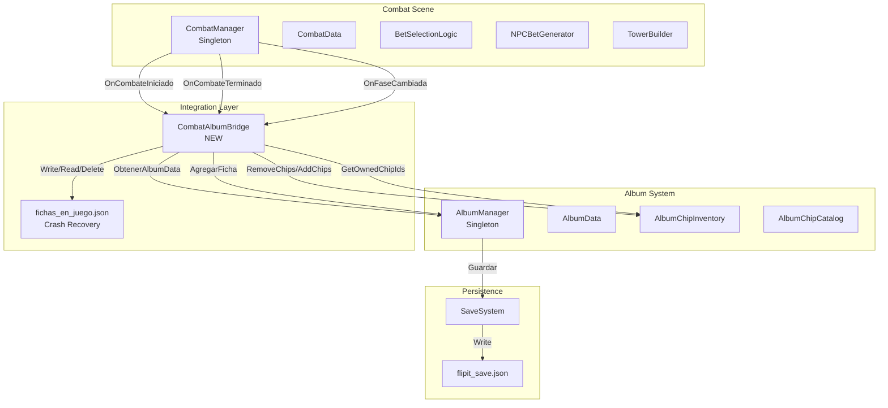
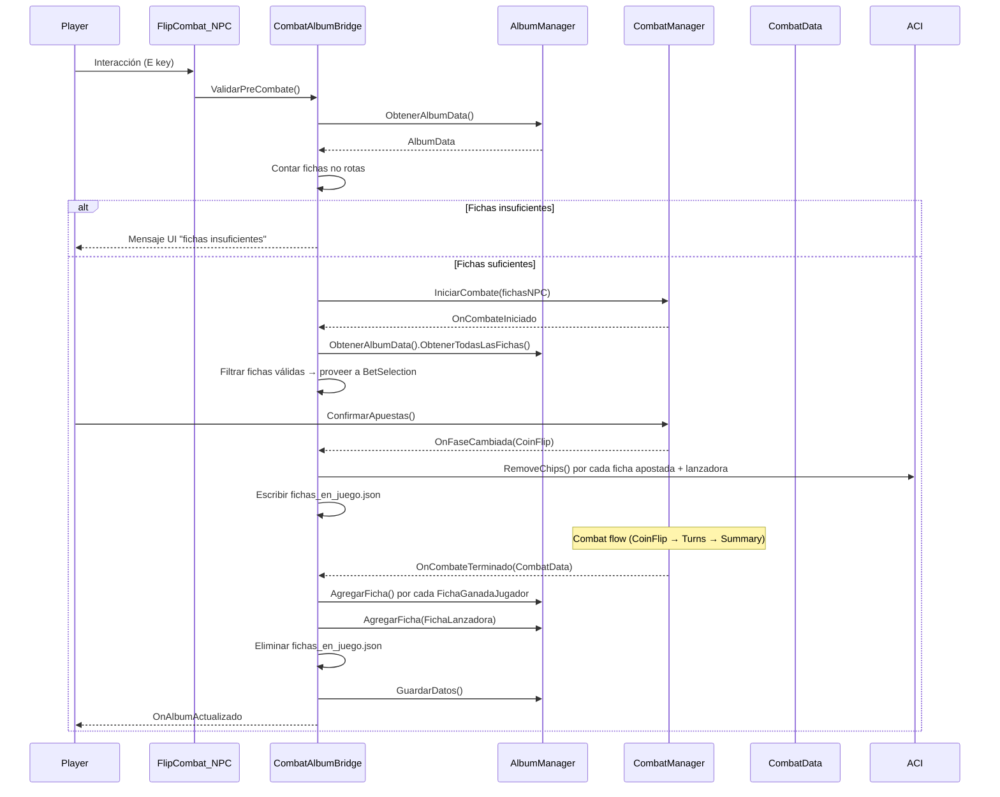
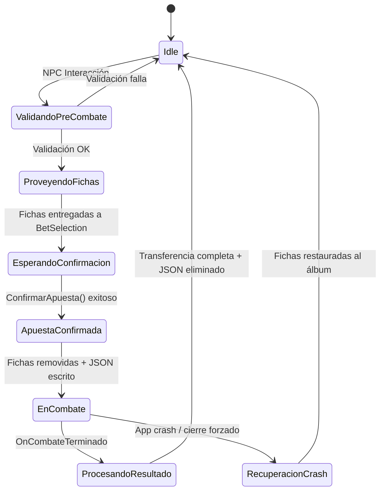

# Design Document

## Overview

Este documento describe el diseño técnico para integrar el sistema de Álbum (colección de fichas del jugador) con el sistema de Combate/Apuestas. El componente central es `CombatAlbumBridge`, un MonoBehaviour externo que se suscribe a eventos del CombatManager sin modificar los archivos existentes (CombatManager.cs, AlbumManager.cs).

El bridge maneja:
- Validación pre-combate (¿tiene el jugador fichas suficientes?)
- Provisión de fichas del álbum a BetSelectionLogic
- Remoción temporal de fichas apostadas del álbum durante el combate
- Persistencia de "fichas en juego" para recuperación ante crash
- Transferencia post-combate: fichas ganadas → álbum, fichas perdidas → permanecen removidas
- Restauración de ficha lanzadora al álbum

La integración opera como un componente observador que reacciona a los eventos existentes del flujo de combate, preservando la estabilidad del sistema actual.

## Architecture

### Diagrama de Arquitectura



### Diagrama de Secuencia — Flujo Completo



### Principios Arquitectónicos

1. **Observer Pattern**: CombatAlbumBridge se suscribe a eventos existentes sin ser referenciado por CombatManager
2. **Fail-Safe**: Toda excepción dentro del bridge se captura internamente sin interrumpir el flujo de combate
3. **Crash Recovery**: Archivo JSON en disco garantiza que fichas no se pierdan ante cierre inesperado
4. **Single Responsibility**: El bridge solo coordina transferencias; no modifica la lógica de combate ni del álbum

## Components and Interfaces

### CombatAlbumBridge (NUEVO)

```csharp
using System;
using System.Collections.Generic;
using System.IO;
using UnityEngine;
using Newtonsoft.Json;

/// <summary>
/// Puente entre el sistema de Combate y el Álbum del jugador.
/// Gestiona validación pre-combate, remoción temporal de fichas,
/// transferencia post-combate y recuperación ante crash.
/// </summary>
public class CombatAlbumBridge : MonoBehaviour
{
    // === Eventos ===
    
    /// <summary>
    /// Se dispara cuando el álbum ha sido actualizado post-combate.
    /// </summary>
    public Action<CombatData> OnAlbumActualizado;

    // === Configuración ===
    
    [Header("Configuración")]
    [SerializeField] private CombatConfig _combatConfig;
    
    [Header("UI Feedback")]
    [SerializeField] private GameObject _mensajeValidacionPanel;
    [SerializeField] private TMPro.TextMeshProUGUI _mensajeValidacionTexto;

    // === Estado Interno ===
    
    private AlbumChipInventory _chipInventory;
    private AlbumChipCatalog _chipCatalog;
    private List<FichaEnJuegoEntry> _fichasEnJuego;
    private bool _apuestaConfirmada;

    private const string CRASH_RECOVERY_FILE = "fichas_en_juego.json";

    // === Lifecycle ===

    /// <summary>
    /// En Awake, verifica si existe archivo de crash recovery y restaura fichas.
    /// </summary>
    private void Awake() { }

    /// <summary>
    /// En OnEnable, se suscribe a eventos del CombatManager.
    /// </summary>
    private void OnEnable() { }

    /// <summary>
    /// En OnDisable, se desuscribe de eventos.
    /// </summary>
    private void OnDisable() { }

    // === API Pública ===

    /// <summary>
    /// Valida si el jugador tiene fichas suficientes para iniciar combate.
    /// Requiere al menos (minFichasApuesta + 1) fichas no rotas.
    /// Retorna true si puede combatir, false si no.
    /// </summary>
    public bool ValidarPreCombate() { return false; }

    /// <summary>
    /// Obtiene las fichas disponibles del álbum para la fase de selección.
    /// Excluye fichas rotas y fichas con cantidad 0.
    /// </summary>
    public List<FichaData> ObtenerFichasDisponiblesParaApuesta() { return null; }

    /// <summary>
    /// Confirma la apuesta: remueve fichas del álbum y persiste a disco.
    /// Retorna true si la operación fue exitosa.
    /// </summary>
    public bool ConfirmarApuesta(List<FichaData> fichasApostadas, FichaData fichaLanzadora) { return false; }

    /// <summary>
    /// Procesa el resultado del combate: transfiere fichas ganadas,
    /// mantiene perdidas removidas, restaura lanzadora, guarda.
    /// </summary>
    public void ProcesarResultadoCombate(CombatData combatData) { }

    // === Crash Recovery ===

    /// <summary>
    /// Verifica si existe archivo de recuperación y restaura fichas al álbum.
    /// </summary>
    private void IntentarRecuperacionCrash() { }

    /// <summary>
    /// Escribe las fichas en juego a disco para crash recovery.
    /// </summary>
    private void PersistirFichasEnJuego() { }

    /// <summary>
    /// Elimina el archivo de crash recovery.
    /// </summary>
    private void EliminarArchivoCrashRecovery() { }

    // === Handlers de Eventos ===

    private void OnCombateIniciado() { }
    private void OnCombateTerminado(CombatData data) { }
    private void OnFaseCambiada(CombatData.CombatPhase fase) { }

    // === Helpers ===

    /// <summary>
    /// Cuenta fichas no rotas en el álbum.
    /// </summary>
    private int ContarFichasNoRotas() { return 0; }

    /// <summary>
    /// Muestra un mensaje de validación en la UI.
    /// </summary>
    private void MostrarMensajeValidacion(string mensaje) { }

    /// <summary>
    /// Oculta el panel de mensaje de validación.
    /// </summary>
    private void OcultarMensajeValidacion() { }
}
```

### BettingAlbumIntegrationSceneBuilder (NUEVO — Editor)

```csharp
using UnityEditor;
using UnityEditor.SceneManagement;
using UnityEngine;

/// <summary>
/// Crea una escena de test para la integración Apuesta-Álbum.
/// Incluye AlbumManager, CombatManager, fichas de prueba y NPC pool.
/// </summary>
public static class BettingAlbumIntegrationSceneBuilder
{
    private const string ScenePath = "Assets/Scenes/BettingAlbumIntegrationTestScene.unity";

    [MenuItem("Flipit/Build Betting Album Integration Test Scene")]
    public static void BuildScene() { }
}
```

### Componentes Existentes Utilizados (SIN MODIFICAR)

| Componente | Interfaz Utilizada | Propósito |
|---|---|---|
| AlbumManager | `Instance`, `AgregarFicha()`, `ObtenerAlbumData()` | Acceso al álbum singleton |
| AlbumData | `ObtenerTodasLasFichas()`, `RemoverFichas()`, `AgregarFicha()` | Operaciones CRUD sobre la colección |
| AlbumChipInventory | `RemoveChips()`, `AddChips()`, `GetOwnedChipIds()` | Adapter string↔int para operaciones |
| CombatManager | `OnCombateIniciado`, `OnCombateTerminado`, `OnFaseCambiada` | Eventos del flujo de combate |
| BetSelectionLogic | `SeleccionarFicha()`, `ValidarSeleccion()` | Validación de selección de apuestas |
| CombatData | `FichasGanadasJugador`, `FichasGanadasNPC`, `FichasApostadasJugador` | Datos de resultado |
| CombatConfig | `minFichasApuesta`, `maxFichasApuesta` | Configuración de límites |
| SaveSystem | `Guardar()`, `Cargar()` | Persistencia a disco |
| NPCBetGenerator | `GenerarApuesta()`, `SeleccionarFichaLanzadora()` | Generación de apuesta NPC |
| TowerBuilder | `ConstruirTorre()` | Construcción de torre lógica |

## Data Models

### FichaEnJuegoEntry (NUEVO)

Estructura serializable para el archivo de crash recovery:

```csharp
using System;
using System.Collections.Generic;

/// <summary>
/// Entrada individual de una ficha en juego (para crash recovery).
/// </summary>
[Serializable]
public class FichaEnJuegoEntry
{
    /// <summary>Template ID de la ficha.</summary>
    public int templateId;
    
    /// <summary>Cantidad de fichas de este tipo en juego.</summary>
    public int cantidad;
    
    /// <summary>Si es true, esta entrada corresponde a la ficha lanzadora.</summary>
    public bool esLanzadora;
    
    /// <summary>Datos mutables completos de la ficha para restauración.</summary>
    public FichaData fichaData;
}

/// <summary>
/// Contenedor para el archivo de crash recovery en disco.
/// </summary>
[Serializable]
public class FichasEnJuegoData
{
    /// <summary>Timestamp del momento en que se confirmó la apuesta.</summary>
    public string timestampConfirmacion;
    
    /// <summary>Lista de fichas removidas del álbum durante el combate.</summary>
    public List<FichaEnJuegoEntry> fichas = new List<FichaEnJuegoEntry>();
}
```

### Archivo JSON de Crash Recovery

Ruta: `Application.persistentDataPath/fichas_en_juego.json`

```json
{
  "timestampConfirmacion": "2024-12-15 14:32:01",
  "fichas": [
    {
      "templateId": 3,
      "cantidad": 1,
      "esLanzadora": false,
      "fichaData": {
        "templateId": 3,
        "nombre": "Dragón Rojo",
        "rareza": "Raro",
        "rango": 2,
        "experienciaDeRango": 15.0,
        "estaRoto": false,
        "desgaste": 20.0,
        "perk": "Peso Extra",
        "peso": 1.5,
        "suerte": 0.8
      }
    },
    {
      "templateId": 7,
      "cantidad": 1,
      "esLanzadora": true,
      "fichaData": {
        "templateId": 7,
        "nombre": "Guerrero",
        "rareza": "Comun",
        "rango": 1,
        "experienciaDeRango": 5.0,
        "estaRoto": false,
        "desgaste": 10.0,
        "perk": "Suerte",
        "peso": 1.0,
        "suerte": 1.2
      }
    }
  ]
}
```

### Modelos Existentes Relevantes

| Clase | Campos Clave | Rol en la Integración |
|---|---|---|
| `FichaData` | `templateId`, `estaRoto`, `nombre`, `rareza`, `peso`, `suerte` | Instancia mutable — unidad de apuesta |
| `AlbumEntry` | `ficha` (FichaData), `cantidad` (int) | Entrada agrupada en el álbum |
| `CombatData` | `FichasApostadasJugador`, `FichasGanadasJugador`, `FichasGanadasNPC`, `FichaLanzadoraJugador` | Estado y resultado del combate |
| `CombatConfig` | `minFichasApuesta` (1), `maxFichasApuesta` (5) | Configuración de límites |
| `TowerSlot` | `Ficha`, `Dueno` (SlotOwner), `EstaVolteada` | Slot individual en la torre |

### Diagrama de Estado del Bridge




## Correctness Properties

*A property is a characteristic or behavior that should hold true across all valid executions of a system — essentially, a formal statement about what the system should do. Properties serve as the bridge between human-readable specifications and machine-verifiable correctness guarantees.*

### Property 1: Filtrado de fichas excluye rotas y sin cantidad

*For any* conjunto de AlbumEntry con valores variados de `estaRoto` y `cantidad`, el resultado de `ObtenerFichasDisponiblesParaApuesta()` SHALL contener únicamente fichas donde `estaRoto == false` AND `cantidad >= 1`.

**Validates: Requirements 1.2, 1.4**

### Property 2: Validación pre-combate bloquea cuando fichas insuficientes

*For any* AlbumData con N fichas no rotas donde N < `CombatConfig.minFichasApuesta + 1`, `ValidarPreCombate()` SHALL retornar false sin modificar el estado del álbum (álbum antes == álbum después).

**Validates: Requirements 1.3, 11.2, 11.4, 11.5**

### Property 3: Selección de apuesta respeta reglas de validez

*For any* conjunto de fichas disponibles, BetSelectionLogic SHALL aceptar entre `minFichas` y `maxFichas` fichas no rotas con templateId únicos, y exactamente una ficha lanzadora no rota cuyo templateId no esté en las fichas apostadas. Toda selección que cumpla estas condiciones SHALL validar exitosamente.

**Validates: Requirements 2.1, 2.2, 2.4, 2.6, 2.7**

### Property 4: Confirmación de apuesta remueve todas las fichas del álbum

*For any* selección válida de fichas apostadas + ficha lanzadora, después de `ConfirmarApuesta()` exitoso, el álbum SHALL tener reducida la cantidad de cada ficha apostada por 1 y la ficha lanzadora por 1. La suma total del álbum después SHALL ser igual a la suma total antes menos (fichas apostadas + 1 lanzadora).

**Validates: Requirements 3.1, 3.5**

### Property 5: Round-trip de crash recovery preserva fichas

*For any* conjunto válido de FichaEnJuegoEntry, serializar a `fichas_en_juego.json` y luego deserializar SHALL producir un conjunto equivalente. Además, si el archivo existe al iniciar el bridge, restaurar fichas al álbum SHALL incrementar las cantidades del álbum exactamente por las cantidades almacenadas en el archivo.

**Validates: Requirements 3.2, 3.4**

### Property 6: Rollback transaccional ante fallo de remoción

*For any* operación de ConfirmarApuesta donde RemoverFichas retorna false para alguna ficha, el estado del álbum después de la operación SHALL ser idéntico al estado antes de la operación (todas las fichas previamente removidas en esa misma operación son restauradas).

**Validates: Requirements 3.3**

### Property 7: NPC genera apuesta válida dentro de restricciones

*For any* NPC pool con al menos una ficha no rota y una cantidad de jugador entre 1 y maxFichas, la apuesta generada SHALL contener únicamente fichas no rotas, con tamaño dentro de [max(1, cantidadJugador-1), min(maxFichas, cantidadJugador+1)], y la ficha lanzadora del NPC (si existe) SHALL ser no rota y no estar en la lista de fichas apostadas.

**Validates: Requirements 4.1, 4.3, 4.4**

### Property 8: Torre contiene exactamente las fichas apostadas

*For any* dos listas de fichas (jugador y NPC), `TowerBuilder.ConstruirTorre()` SHALL producir una lista de TowerSlots donde: el tamaño total es igual a `fichasJugador.Count + fichasNPC.Count`, cada slot tiene FichaData no nula, SlotOwner correcto (Jugador o NPC según origen), y estado inicial no volteada.

**Validates: Requirements 5.1, 5.3**

### Property 9: Fichas volteadas se asignan al jugador del turno actual

*For any* TurnOwner (Jugador o NPC) y cualquier conjunto de TowerSlots volteados durante un lanzamiento, `CombatData.RegistrarLanzamiento()` SHALL agregar las fichas de esos slots a `FichasGanadasJugador` si el turno es del Jugador, o a `FichasGanadasNPC` si el turno es del NPC, independientemente del SlotOwner original del slot.

**Validates: Requirements 6.1, 6.2**

### Property 10: Estado del álbum post-combate es correcto

*For any* resultado de combate (CombatData con FichasGanadasJugador, FichasGanadasNPC, FichasApostadasJugador, FichaLanzadoraJugador), después de `ProcesarResultadoCombate()` el álbum del jugador SHALL:
1. Contener todas las fichas de FichasGanadasJugador (incremento de cantidad)
2. NO contener las fichas perdidas (fichas en FichasGanadasNPC que pertenecían a FichasApostadasJugador)
3. Contener la FichaLanzadoraJugador restaurada (incremento de 1)
4. No verse afectado por fichas en FichasGanadasNPC cuyo SlotOwner original era NPC

**Validates: Requirements 7.1, 7.2, 7.3, 8.1, 8.5**

### Property 11: Bridge aísla excepciones sin interrumpir combate

*For any* excepción lanzada durante el procesamiento de eventos del bridge (OnCombateIniciado, OnCombateTerminado, OnFaseCambiada), la excepción SHALL ser capturada internamente y el CombatManager SHALL continuar su ejecución sin interrupciones.

**Validates: Requirements 10.5**

## Error Handling

### Estrategia de Manejo de Errores

| Escenario | Acción | Severidad |
|---|---|---|
| AlbumManager.Instance es null | Bloquear combate, Debug.LogError | Crítico |
| ObtenerTodasLasFichas() retorna null | Bloquear combate, Debug.LogError | Crítico |
| RemoverFichas() retorna false | Rollback completo, Debug.LogError, cancelar apuesta | Crítico |
| Excepción en handler de evento | Capturar con try/catch, Debug.LogError, continuar | Alto |
| Crash recovery file corrupto | Debug.LogWarning, eliminar archivo, continuar sin restaurar | Medio |
| FichasGanadasJugador es null | Omitir operación, Debug.LogWarning, continuar | Medio |
| FichaLanzadoraJugador es null | Omitir restauración, Debug.LogWarning, continuar | Medio |
| SaveSystem.Guardar() retorna false | Reintentar 3 veces con 1s intervalo, mantener en memoria | Alto |
| IOException al escribir crash file | Debug.LogError, continuar combate (riesgo aceptado) | Medio |

### Patrón de Captura de Excepciones en Handlers

```csharp
private void OnCombateTerminado(CombatData data)
{
    try
    {
        ProcesarResultadoCombate(data);
    }
    catch (Exception ex)
    {
        Debug.LogError($"[CombatAlbumBridge] Error procesando resultado: {ex.Message}\n{ex.StackTrace}");
        // El combate continúa normalmente — el bridge falla silenciosamente
    }
}
```

### Patrón de Rollback Transaccional

```csharp
public bool ConfirmarApuesta(List<FichaData> fichasApostadas, FichaData fichaLanzadora)
{
    var fichasRemovidas = new List<(string chipId, int cantidad)>();
    
    try
    {
        foreach (var ficha in fichasApostadas)
        {
            string chipId = ficha.templateId.ToString();
            if (!_chipInventory.RemoveChips(chipId, 1))
            {
                // Rollback: restaurar todas las fichas ya removidas
                foreach (var removida in fichasRemovidas)
                {
                    _chipInventory.AddChips(removida.chipId, removida.cantidad);
                }
                Debug.LogError($"[CombatAlbumBridge] Fallo al remover ficha {chipId}. Rollback ejecutado.");
                return false;
            }
            fichasRemovidas.Add((chipId, 1));
        }
        
        // Remover lanzadora
        string lanzadoraId = fichaLanzadora.templateId.ToString();
        if (!_chipInventory.RemoveChips(lanzadoraId, 1))
        {
            foreach (var removida in fichasRemovidas)
            {
                _chipInventory.AddChips(removida.chipId, removida.cantidad);
            }
            Debug.LogError($"[CombatAlbumBridge] Fallo al remover lanzadora {lanzadoraId}. Rollback ejecutado.");
            return false;
        }
        
        // Persistir a disco
        PersistirFichasEnJuego();
        _apuestaConfirmada = true;
        return true;
    }
    catch (Exception ex)
    {
        // Rollback ante excepción inesperada
        foreach (var removida in fichasRemovidas)
        {
            _chipInventory.AddChips(removida.chipId, removida.cantidad);
        }
        Debug.LogError($"[CombatAlbumBridge] Excepción durante confirmación: {ex.Message}");
        return false;
    }
}
```

### Patrón de Reintentos de Guardado

```csharp
private System.Collections.IEnumerator GuardarConReintentos(int maxReintentos = 3, float intervalo = 1f)
{
    for (int intento = 1; intento <= maxReintentos; intento++)
    {
        SaveData saveData = new SaveData();
        saveData.album = AlbumSaveData.CrearDesdeAlbum(AlbumManager.Instance.ObtenerAlbumData());
        
        if (SaveSystem.Guardar(saveData))
        {
            Debug.Log($"[CombatAlbumBridge] Guardado exitoso (intento {intento}). Fichas únicas: {AlbumManager.Instance.ObtenerAlbumData().ObtenerTotalFichasUnicas()}");
            yield break;
        }
        
        Debug.LogWarning($"[CombatAlbumBridge] Guardado fallido (intento {intento}/{maxReintentos}). Reintentando en {intervalo}s...");
        yield return new WaitForSeconds(intervalo);
    }
    
    Debug.LogWarning("[CombatAlbumBridge] Todos los reintentos de guardado fallaron. Estado en memoria pendiente de persistencia.");
}
```

## Testing Strategy

### Enfoque Dual: Unit Tests + Property-Based Tests

La estrategia de testing combina pruebas unitarias para casos concretos y edge cases con pruebas basadas en propiedades para verificar invariantes universales.

### Property-Based Testing

**Librería**: [FsCheck](https://github.com/fscheck/FsCheck) via NUnit adapter (compatible con Unity Test Framework)

**Configuración**:
- Mínimo 100 iteraciones por propiedad
- Cada test referencia su propiedad del diseño

**Tag format**: `Feature: flipit-betting-album-integration, Property {number}: {property_text}`

**Propiedades a implementar con PBT**:

| Propiedad | Generadores Necesarios |
|---|---|
| P1: Filtrado | Gen<List<AlbumEntry>> con estaRoto/cantidad aleatorios |
| P2: Validación pre-combate | Gen<AlbumData> con N fichas no rotas (variando N) |
| P3: Selección válida | Gen<List<FichaData>> válidas + combinaciones de selección |
| P4: Remoción al confirmar | Gen<AlbumData> + Gen<List<FichaData>> apostadas |
| P5: Crash recovery round-trip | Gen<FichasEnJuegoData> con fichas aleatorias |
| P6: Rollback transaccional | Gen<AlbumData> con cantidades insuficientes para causar fallo |
| P7: NPC bet válida | Gen<List<FichaData>> pool + Gen<int> cantidadJugador |
| P8: Torre correcta | Gen<List<FichaData>> jugador + Gen<List<FichaData>> NPC |
| P9: Asignación de volteo | Gen<TurnOwner> + Gen<List<TowerSlot>> |
| P10: Estado post-combate | Gen<CombatData> con resultados aleatorios |
| P11: Aislamiento de excepciones | Gen<Exception> inyectada en handlers |

### Unit Tests (Example-Based)

**Casos concretos a cubrir**:

1. **Pre-combat validation**:
   - Álbum con exactamente minFichasApuesta fichas no rotas → bloqueo
   - Álbum con 0 fichas → bloqueo
   - Álbum con todas las fichas rotas → bloqueo
   - Álbum con minFichasApuesta + 1 fichas no rotas → permite

2. **Bet confirmation**:
   - Confirmación exitosa con 3 fichas + lanzadora
   - Fallo por ficha inexistente en álbum (rollback verificado)
   - Crash file creado después de confirmación exitosa

3. **Post-combat transfer**:
   - Victoria total: todas las fichas ganadas agregadas al álbum
   - Derrota total: todas las fichas apostadas permanecen removidas
   - Empate parcial: mezcla de fichas ganadas y perdidas
   - Lanzadora siempre restaurada independientemente del resultado

4. **Crash recovery**:
   - Archivo existe → fichas restauradas al álbum
   - Archivo corrupto → eliminado sin crash
   - Archivo no existe → no-op

5. **Edge cases**:
   - AlbumManager null
   - CombatData con listas null
   - NPC pool vacío / todas rotas
   - NPC pool más pequeño que cantidad requerida

### Integration Tests (Unity Play Mode)

- Flujo completo: NPC interacción → validación → selección → confirmación → combate → summary → álbum actualizado
- Crash recovery: escribir archivo, recargar escena, verificar restauración
- Escena de test creada por `BettingAlbumIntegrationSceneBuilder`

### Estructura de Archivos de Test

```
Assets/
├── Tests/
│   ├── EditMode/
│   │   ├── CombatAlbumBridgeFilterTests.cs
│   │   ├── CombatAlbumBridgeValidationTests.cs
│   │   ├── CombatAlbumBridgeConfirmationTests.cs
│   │   ├── CombatAlbumBridgePostCombatTests.cs
│   │   ├── CombatAlbumBridgeCrashRecoveryTests.cs
│   │   ├── CombatAlbumBridgePropertyTests.cs   ← PBT
│   │   └── BetSelectionLogicPropertyTests.cs    ← PBT
│   └── PlayMode/
│       └── BettingAlbumIntegrationFlowTests.cs
```
